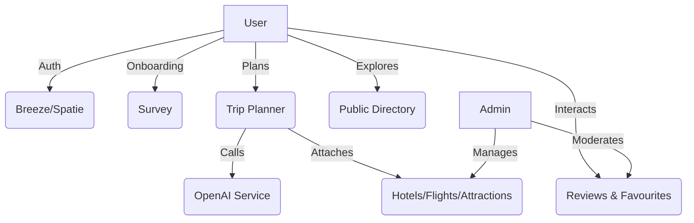

# ThreeDOS API Specification & 15-Phase Plan

<callout icon="🎯" color="blue_bg">
**Project Overview:** This document serves as the master API specification and 15-Phase development roadmap for the Smart AI Travel Planner (ThreeDOS).
</callout>

## 🏃‍♂️ Sprint 1 (Active)
<callout icon="⏳" color="red_bg">
**DEADLINE:** Sunday 11:59 PM. All endpoints assigned below must be completed, tested, and pushed.
</callout>

*   **Auth Module:** Sara / Lojy (Endpoints: `/register`, `/login`, `/logout`, `/profile`)
*   **Onboarding:** Sama (Endpoints: `/onboarding` GET/POST)
*   **Trip:** Fady (First 3: Create, Store, Show) | Adham (Last 2: Attach, Detach)
*   **Explore Directory:** Kenzy (First 4: Destinations, Hotels) | Hana (Last 4: Restaurants, Attractions)
*   **Category:** Rana (Endpoints: `/categories`, `/categories/{id}`)
*   **User Interaction:** Tyson (Endpoints: `/favourites`, `/reviews`)

---

## 🗺️ 15-Phase Development Plan

<callout icon="🚀" color="green_bg">
We have condensed the project lifecycle into **15 distinct phases** to streamline delivery.
</callout>

### Phase 1: Foundation & Database
Setup Laravel 12, BootstrapMade template, run all 19 migrations, and scaffold Eloquent models.

### Phase 2: Auth & Identity
Implement Laravel Breeze and Spatie `laravel-permission` for role-based access control.

### Phase 3: External API Proxies & Seeding
Live API seeding for `Countries`. Fixture JSON seeding for `Hotels`, `Flights`, `Restaurants`.

### Phase 4: User Onboarding
Build the `SurveyController` to capture travel style, budget, and interests as JSON.

### Phase 5: Public Exploration Directory
Build read-only endpoints for users to browse seeded destinations, hotels, and attractions.

### Phase 6: Categories Management
Implement category filtering (Beaches, Mountains) for attractions and restaurants.

### Phase 7: Core Trip Planner
Wizard for creating trips (Destination, Days, Budget, Travelers).

### Phase 8: AI Itinerary Generation
Integrate OpenAI API. Inject Survey + Trip data to generate a daily itinerary JSON.

### Phase 9: Trip Bookings & Pivots
Logic to attach specific Flights, Hotels, and Attractions to a user's Trip.

### Phase 10: Interactive Maps Integration
Leaflet.js map rendering for destination attractions and trip routes.

### Phase 11: User Interactions (Community)
Polymorphic AJAX endpoints for submitting Reviews (Stars) and Favourites (Hearts).

### Phase 12: User Dashboard & Analytics
Personal statistics, saved trips, and booking history panels.

### Phase 13: Jobs, Notifications & Settings
Background queues for AI generation, in-app notification bell, and global settings cache.

### Phase 14: Admin Dashboard & Moderation
Full CRUD for entities, Review moderation queue (Approve/Reject), and User Blocking.

### Phase 15: QA, Optimization & Deployment
N+1 query fixes, PHPUnit tests, caching, and production server deployment.

---

## 🏗️ Missing / Planned Endpoints (Future Scope)

<callout icon="⚠️" color="yellow_bg">
The following features are identified but **NOT** part of the current ERD or scope. We will design and add these endpoints later when business logic is finalized.
</callout>

| Feature | Notes |
|---|---|
| **Reports** | To generate PDF/CSV exports for Admin Analytics (Revenue, User Growth). |
| **Payment Gateway** | For processing live bookings (Stripe / PayPal integration). |
| **Transactions** | To record payment history, refunds, and booking receipts. |

---

## 📊 Architecture Diagram

