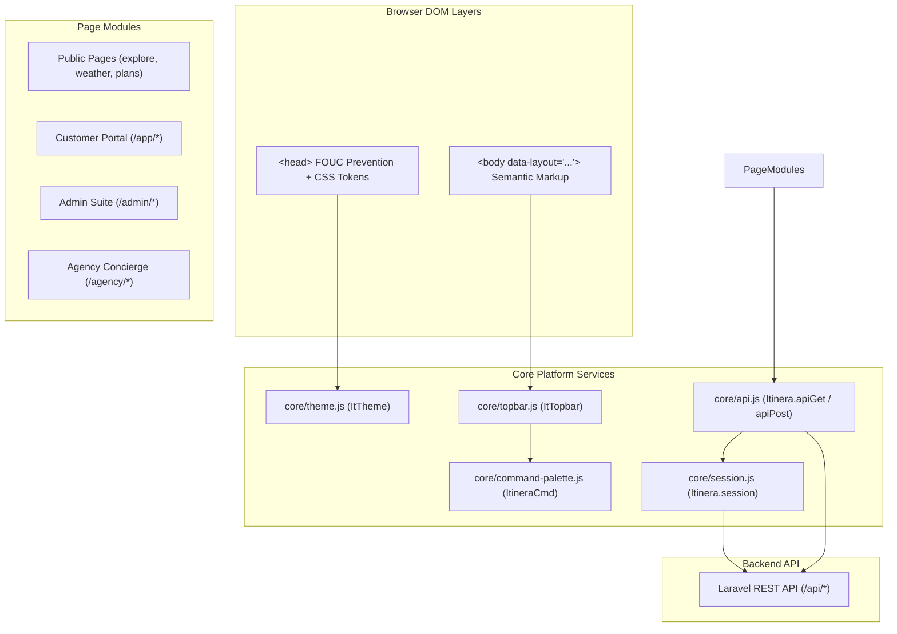

# Phase 1 — Frontend Architecture & Folder Structure Audit

> **Audit Type**: Architecture, Modular Organization & Dependency Audit  
> **Date**: 2026-08-14  
> **Auditor**: Antigravity AI  
> **Status**: Verified

---

## 1. Architecture Overview

The Itinera frontend is architected as a **Static Multi-Page Application (MPA)** driven by Vanilla JavaScript (ES6+), custom CSS Design Tokens (`tokens.css`), Tailwind CSS utility classes, and browser DOM APIs interfacing with a Laravel 11 REST API backend.



---

## 2. Identified Subsystems & Competing Layer Stacks

Our audit identified **three parallel layers** in the JavaScript codebase:

1. **The Modern Unified Core (`assets/js/core/`)**:
   - `core/theme.js`: Single source of truth for dark/light mode toggling, `itinera_theme` key, and `html.dark` class.
   - `core/topbar.js`: Role-aware chrome injector rendering theme toggle, notification bell with unread badge, user chip menu, and command palette trigger.
   - `core/command-palette.js`: Global `Ctrl+K` launcher for search, navigation, unread notifications, and quick actions.
   - `core/session.js`: JWT storage, proactive token expiration inspection, 401 refresh queue, and route guard redirects.
   - `core/api.js`: Unified fetch client handling Authorization headers, CSRF, and JSON unwrapping.

2. **The Page Controller Layer (`assets/js/` & `assets/js/modules/`)**:
   - Dedicated scripts for individual pages (e.g. `admin-destinations.js`, `trip.js`, `explore.js`, `public-home.js`, `favourites.js`).
   - Clean integration with `window.Itinera` namespace.

3. **Legacy / Parallel Artifact Tree (`js/` & `css/`)**:
   - `js/app.js`, `js/chat.js`, `js/catalog-common.js`, `js/plans-core.js`.
   - `css/app.css`, `css/catalog.css`, `css/components/*`.
   - **Architectural Violation**: These legacy folders duplicate functionality already provided by `assets/js/` and `assets/css/tokens.css`.

---

## 3. Script Loading & Execution Order

In standard HTML templates, scripts execute in the following sequence:

```html
<!-- 1. Inline Head: FOUC Instant Dark Prevention -->
<script>/* FOUC prevention — default dark */ ...</script>

<!-- 2. Configuration & Core API -->
<script src="assets/js/config.js"></script>
<script src="assets/js/api.js"></script>
<script src="assets/js/session.js"></script>

<!-- 3. Page Specific Logic -->
<script src="assets/js/<page-controller>.js"></script>

<!-- 4. Global Injected UI Chrome -->
<script src="assets/js/core/topbar.js"></script>
<script src="assets/js/core/theme.js"></script>
```

### Fragility & Dependency Risks
- **Implicit Global Dependency**: Page scripts rely on `window.Itinera` being instantiated by `assets/js/config.js` and `assets/js/api.js` prior to execution. If script tags are reordered, page scripts fail with `ReferenceError: Itinera is not defined`.
- **Top-Level Event Handlers**: Several legacy scripts bind to `DOMContentLoaded` without defensive checks if the event already fired before script evaluation.

---

## 4. Core Architecture Questions & Findings

| # | Architecture Audit Question | Finding & Evidence | Severity |
| :-: | :--- | :--- | :---: |
| **Q1** | **Is there ONE canonical API layer?** | **Partially**. `assets/js/core/api.js` (and `assets/js/api.js`) is the canonical client handling JWT headers, auto-refresh queue, and response unwrapping. However, a legacy `js/api.js` client still exists in the codebase. | Medium |
| **Q2** | **Is there ONE canonical session/auth layer?** | **Yes**. `assets/js/core/session.js` handles token storage, proactive expiry checking, storage events for multi-tab sync, and route guards. `assets/js/auth.js` serves as the form controller. | Low |
| **Q3** | **Is configuration centralized?** | **Yes**. `assets/js/config.js` configures `window.Itinera.CONFIG` with base API paths (`/api`) and global timeout settings. | Low |
| **Q4** | **Are page scripts isolated correctly?** | **Yes**. Page scripts wrap their execution in IIFEs (`(function(global){...})(window)`) to prevent local variable leaking. | Low |
| **Q5** | **Are shared utilities really shared?** | **Yes**. `tokens.css`, `core/theme.js`, `core/topbar.js`, and `core/command-palette.js` are shared universally across all 88 HTML pages. | Optimal |
| **Q6** | **Are there circular/implicit dependencies?** | **Yes**. Page scripts implicitly depend on `config.js` and `api.js` executing before them in the DOM tree. | Medium |
| **Q7** | **Are global variables used?** | **Yes**. Four designated global namespaces are used: `window.Itinera`, `window.ItTheme`, `window.ItTopbar`, and `window.ItineraCmd`. | Low |
| **Q8** | **Are scripts loaded in a fragile order?** | **Yes**. Standard synchronous `<script>` tags rely on precise document order. Missing `defer` attributes present slight execution timing risks if reordered. | Medium |

---

## 5. Key Architectural Findings

| Finding ID | Category | Severity | Description |
| :--- | :--- | :---: | :--- |
| **ARCH-01** | Dual Root Trees | Medium | Root-level `js/` and `css/` coexist with `assets/js/` and `assets/css/`, creating ambiguity regarding the canonical script location. |
| **ARCH-02** | Root Auth Aliases | Low | Auth pages exist in both `/auth/login.html` and root `/login.html` to prevent 404s on flat deployments. |
| **ARCH-03** | Global Namespace | Low | Platform services attach to `window.Itinera`, `window.ItTheme`, `window.ItTopbar`, and `window.ItineraCmd`. |

---

## 6. Architectural Recommendations

1. **Consolidate Script Roots**: Phase out the root `js/` directory by migrating remaining unique logic into `assets/js/` and removing duplicate legacy scripts.
2. **Standardize Module Loading**: Ensure every HTML template follows the canonical `<script defer>` load order to prevent timing bugs.
3. **Formalize Layout Enums**: Standardize `data-layout` (`public`, `app`, `admin`, `agency`, `auth`) across all templates.

