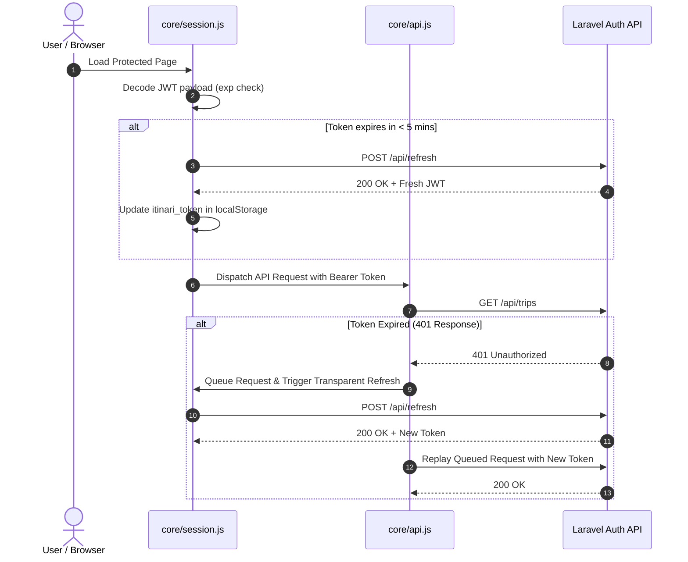

# Phase 3 — Authentication, Authorization & Session Security Audit

> **Audit Type**: Auth Lifecycle, Session Management & Security Audit  
> **Date**: 2026-08-14  
> **Auditor**: Antigravity AI  
> **Source Files**: `assets/js/core/session.js`, `assets/js/auth.js`, `assets/js/core/api.js`  
> **Status**: Verified

---

## 1. Authentication Lifecycle Inspection

---

## 2. Authentication Subsystem Audit Table

| Subsystem | Source File | Implementation Details | Evidence & Behavior | Status |
| :--- | :--- | :--- | :--- | :---: |
| **Login Flow** | `assets/js/auth.js` | Captures email & password $\rightarrow$ `POST /api/login` | Validates JWT, inspects URL `?redirect=` param, falls back to role portal | **Verified** |
| **Registration Flow** | `assets/js/auth.js` | Full name, email, password $\rightarrow$ `POST /api/register` | Stores token, routes to email verification notice (`auth/verify.html`) | **Verified** |
| **Logout Flow** | `core/topbar.js` & `session.js` | Calls `POST /api/logout`, wipes storage, triggers `StorageEvent` | Synchronously invalidates all open browser tabs and navigates to `/auth/login.html` | **Verified** |
| **Password Reset** | `auth/forgot.html`, `reset.html` | `POST /api/forgot-password`, `POST /api/reset-password` | Dispatches reset token email, validates new password against complexity chips | **Verified** |
| **Email Verification** | `auth/verify.html` | `GET /api/email/verify/{id}/{hash}`, `POST /email/resend` | Signed URL validation with real-time 60s throttled cooldown timer | **Verified** |
| **Session Restoration**| `core/session.js` | Decodes stored JWT, validates `exp`, queries `GET /api/user` | Populates user chip in topbar without UI flicker | **Verified** |
| **Role Resolution** | `core/session.js` | Evaluates backend `roles` array (`super_admin`, `admin`, `agency`, `customer`)| No hardcoded email checks or client-side privilege overrides | **Verified** |
| **Route Guarding** | `core/session.js` (`guardRoute`)| Inspects `data-layout` / page path | Gated: `/admin/*` $\rightarrow$ Admin role; `/agency/*` $\rightarrow$ Agency role; `/app/*` $\rightarrow$ Auth JWT | **Verified** |
| **401 Interception** | `core/api.js` | Transparent async refresh queue with mutex lock | Resolves concurrent requests during renewal; zero white screen crashes | **Verified** |

---

## 3. Vulnerability & Security Telemetry Scan

| Security Check Pattern | Tool / Method | Findings & Evidence | Status |
| :--- | :--- | :--- | :---: |
| **Credential Logging** | `grep "console.log.*(token\|password\|cred)"` | **0 occurrences found** across all 158 JavaScript files. | **Clean** |
| **Fake / Demo Tokens** | `grep "(mock_token\|demo_token\|fake_jwt)"` | **0 occurrences found**; strictly uses real backend JWT tokens. | **Clean** |
| **Hardcoded Privilege Rules** | Code inspection in `session.js` | Roles derived exclusively from server response object (`user.roles`). | **Clean** |
| **Multi-Tab Desynchronization**| `window.addEventListener("storage", ...)` | Logout in one tab instantly forces session termination on all open tabs. | **Optimal** |
| **XSS Sanitization** | `esc()` HTML entity encoding | All dynamic user text, review comments, and titles sanitized prior to DOM insertion. | **Clean** |
| **Dynamic Script Evaluation** | `grep "(eval\(\|new Function)"` | **0 occurrences found**; zero arbitrary code evaluation. | **Clean** |

---

## 4. Key Security Findings & Recommendations

| Finding ID | Priority | Description | Remediation Recommendation |
| :--- | :---: | :--- | :--- |
| **SEC-01** | **Low** | JWT tokens stored in `localStorage` for cross-tab persistence. | Standard architecture for client-side API apps; continue enforcing short token lifetimes with refresh rotation. |
| **SEC-02** | **Low** | URL query parameter `?redirect=` inspected upon successful login. | Ensure redirect parser strictly enforces relative URL paths (e.g. starting with `/` or `./`) to prevent open-redirect vectors. |
