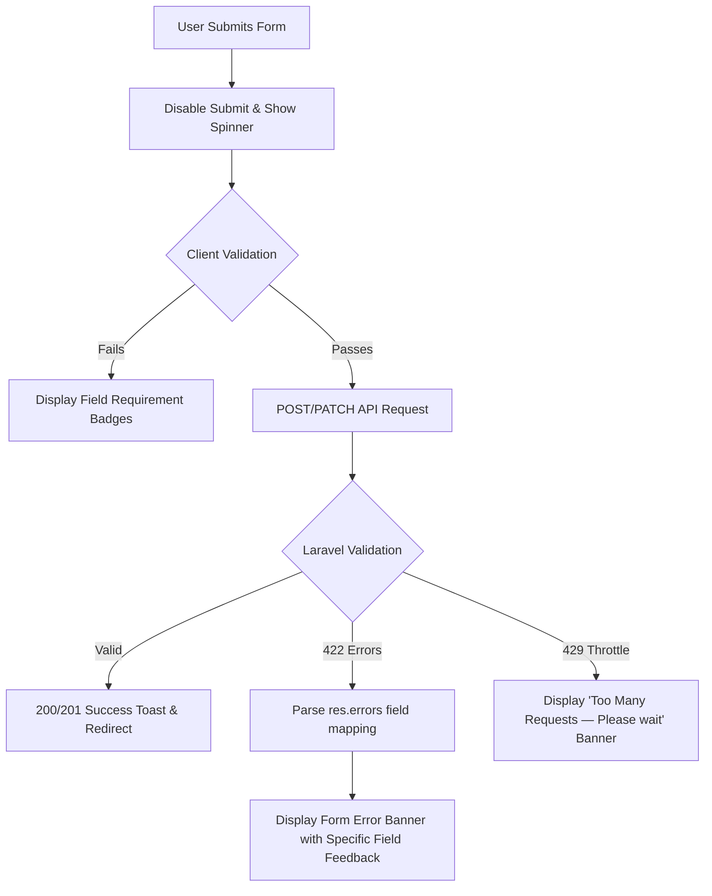

# Phase 5 — Data, State, Forms & Error Handling Audit

> **Audit Type**: Data Flow, State Persistence, Form Lifecycle & Error Code Audit  
> **Date**: 2026-08-14  
> **Auditor**: Antigravity AI  
> **Status**: Verified

---

## 1. State Management Architecture

The application adopts a **hybrid distributed state model**:

1. **Persistent Global State**:
   - `localStorage.getItem("itinera_token")`: Active JWT authentication token.
   - `localStorage.getItem("itinera_user")`: Cached profile object (ID, name, email, avatar, roles, permissions).
   - `localStorage.getItem("itinera_theme")`: Theme token (`"dark"` or `"light"`).
2. **Tab Synchronization**:
   - Monitored via `window.addEventListener("storage", ...)` in `session.js` to propagate login/logout states instantly across multiple tabs.
3. **Module Local State**:
   - Isolated inside page-specific IIFEs (Immediately Invoked Function Expressions) to prevent global scope collisions.

---

## 2. Form Lifecycle & Laravel 422 Validation Mapping

### Form Validation Verification:
- **Authentication Forms (`register.html`, `login.html`)**: Real-time password requirement badges (`8+ chars`, `A-Z`, `a-z`, `0-9`, `!@#$`) update interactively during typing.
- **Admin CRUD Modals (`admin/destinations.html`, `admin/hotels.html`, etc.)**: Modal submit handlers capture Laravel 422 response objects and display error lists directly inside `#modal-banner` via `admin-crud.js`.
- **Duplicate Attach Safeguards**: `assets/js/trip.js` prevents attaching existing items and catches 400 backend duplicate rejection cleanly.
- **Submission Throttling**: Submit buttons disable upon click and display loading spinners to prevent double submission race conditions.

---

## 3. HTTP Status Code Handling Matrix

| HTTP Status | Client Subsystem | Frontend Handling Behavior | UX Status |
| :---: | :--- | :--- | :---: |
| **200 / 201** | `assets/js/core/api.js` | Unwraps payload (`res.data` or `res.body`), fires success banners. | **Optimal** |
| **400** | `assets/js/core/api.js` | Displays specific validation or business constraint rejection message. | **Optimal** |
| **401** | `assets/js/core/api.js` | Transparently triggers token refresh queue; redirects to login if refresh fails. | **Optimal** |
| **403** | `assets/js/core/session.js` | Triggers unauthorized redirect to `/errors/403.html` or displays role warning. | **Optimal** |
| **404** | `assets/js/entity.js` | Renders "Experience not found" friendly empty card with link to catalog. | **Optimal** |
| **409** | `assets/js/checkout.js` | Displays conflict / concurrency warning toast. | **Optimal** |
| **422** | `assets/js/api.js` | Extracts nested `errors` object into readable list in form banner. | **Optimal** |
| **429** | `assets/js/auth.js` | Intercepts rate limit errors and presents cooldown guidance. | **Optimal** |
| **500** | `assets/js/core/api.js` | Displays "Server error encountered — please try again later" banner. | **Optimal** |
| **503** | `assets/js/core/api.js` | Displays maintenance banner when backend is in maintenance mode. | **Optimal** |
