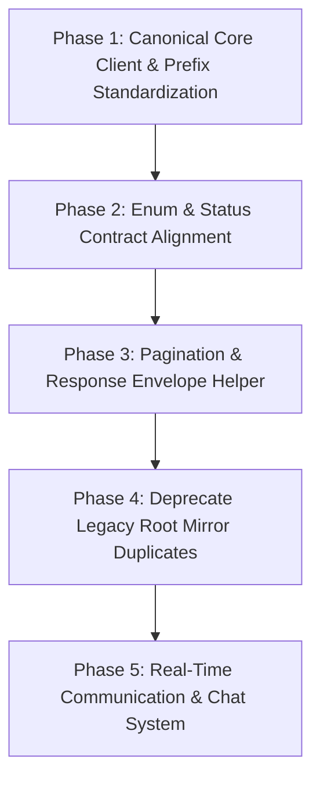

# OpenCode — Fullstack Unification Audit Report
**Backend + Frontend Architecture, API Contract & Repository Consistency**

* **Audit Date:** August 14, 2026
* **Repository:** `Team2-Conference-Project`
* **Active Branch:** `chore/fullstack-restructure`
* **Scope:** Full repository read-only structural & contract audit (`fullstack/Backend` & `fullstack/Frontend`)
* **Mode:** STRICTLY READ-ONLY (No code modified, no migrations executed, no packages installed)

---

## A. Executive Summary

The repository has been successfully restructured into two distinct top-level directories:
* `fullstack/Backend/`: A robust, modular Laravel 12 API backend adhering strictly to PSR-12, service-layer separation, Spatie authorization, JWT authentication, and Form Request validation (278 passing tests across 1,019 assertions).
* `fullstack/Frontend/`: A vanilla HTML5/CSS3/JavaScript SPA/MPA frontend with specialized sub-workspaces (`public/`, `app/`, `admin/`, `agency/`, `auth/`), unified design tokens (`tokens.css`), and an adaptive app shell with dynamic topbar controls.

### Core Audit Finding
The backend and frontend are **conceptually aligned** in business goals, but exhibit **dual-routing legacies, duplicate utility files, and endpoint prefix fragmentation**. Specifically:
1. **Dual Routing & Endpoint Fragmentation:** Backend supports both `/api/...` and `/api/v1/...` for catalog endpoints, while frontend JS files inconsistently call bare `/trips`, `/api/trips`, or `/v1/trips`.
2. **File Duplication in Frontend:** Flat root-level files (e.g., `login.html`, `trips.html`, `explore.html`, `assets/js/api.js`, `assets/js/session.js`) coexist with structured subfolder files (`auth/login.html`, `app/trips.html`, `public/explore.html`, `assets/js/core/api.js`, `assets/js/core/session.js`).
3. **Response Envelope Standardization:** Backend consistently wraps responses via `ApiResponse` (`{ success: true, message: "...", data: {...}, meta: {...} }`), but legacy frontend scripts inconsistently expect Axios-style `res.data` vs Fetch-style `res.body.data`.
4. **External Services Integration:** **100% compliant.** All third-party providers (Open-Meteo, Groq AI, OpenStreetMap Nominatim, Paymob) are strictly proxied through Laravel backend service wrappers; zero API keys or external domains are exposed directly to the browser.
5. **Chat Readiness:** The system has **High Foundations** (User/Agency models, Notification subsystem, Queues, AI Concierge), but requires WebSocket/Reverb broadcasting infrastructure and Conversation/Message domain models before implementing live real-time assistance.

---

## B. Repository Structure Verification

* **Root Path:** `fullstack/`
  * `fullstack/Backend/` (Laravel 12 Project)
  * `fullstack/Frontend/` (Frontend Web Application)
* **Integrity Checks:**
  * ✅ No duplicate `Backend/Backend` or `Frontend/Frontend` nesting detected.
  * ✅ No orphan root project directories active.
  * ✅ Git branch confirmed on `chore/fullstack-restructure`.

---

## C. Backend Inventory Summary

| Layer / Component | Count | Key Classes / Details |
| :--- | :--- | :--- |
| **Models** | 33 | `User`, `Role`, `UserPoint`, `Attraction`, `Category`, `Country`, `Destination`, `Flight`, `Hotel`, `Region`, `Restaurant`, `Address`, `AgencyAssignment`, `Order`, `OrderItem`, `Payment`, `Plan`, `Subscription`, `ContactMessage`, `Flag`, `Notification`, `PasswordResetToken`, `Report`, `Setting`, `Survey`, `AiRecommendation`, `BudgetSnapshot`, `Favourite`, `ItineraryItem`, `Review`, `Trip`, `TripContribution`, `TripDestination` |
| **Controllers** | 46 | Distributed into domain namespaces: `Account/` (Auth, User, Password), `Catalog/` (Destination, Hotel, Restaurant, Attraction, Category, Country, Region, Flight, Stats), `Commerce/` (Agency, Checkout, Plan, Subscription, Payment, Webhook), `System/` (Contact, Flag, Report, Setting, Survey, Weather), `Trips/` (Trip, AI, Interaction, Map, Fork) |
| **Form Requests** | 42 | Dedicated validation requests (e.g., `RegisterRequest`, `LoginRequest`, `TripStoreRequest`, `CheckoutRequest`, `SurveyStoreRequest`, etc.) returning RFC-7807/Laravel 422 JSON envelopes |
| **API Resources** | 15 | `AttractionResource`, `DestinationCardResource`, `DestinationDetailResource`, `HotelResource`, `RestaurantResource`, `TripResource`, `UserResource`, `OrderResource`, etc. |
| **Enums** | 15 | PHP 8.2 Backed Enums: `TripStatus`, `OrderStatus`, `PaymentStatus`, `AgencyAssignmentStatus`, `ContactMessageStatus`, `FlagStatus`, `FlightStatus`, `NotificationStatus`, `ReviewStatus`, `SubscriptionStatus`, `BudgetLevel`, `BudgetTier`, `BillingCycle`, `CheckoutType`, `Currency` |
| **Policies & Gates** | 3 Policies + Spatie | `TripPolicy`, `AgencyAssignmentPolicy`, `FlagPolicy`, verified email gates, Spatie permission gates (`permission:generate ai itineraries`, `role:admin`, `role:agency`) |
| **Services** | 39 | Encapsulated business layer: `CheckoutService`, `PaymobGateway`, `PaymobClient`, `TripService`, `TripForkService`, `GroqService`, `OpenMeteoService`, `OpenStreetService`, `GenerateReportService`, etc. |
| **Events & Listeners** | 5 Events / 2 Listeners | `TripCreated`, `TripForked`, `PaymentCompleted`, `OrderFulfilled`, `SubscriptionActivated` |
| **Notifications & Mail** | 10 Notifs / 9 Mailables | Database notifications and queued transactional emails (`WelcomeNotification`, `PaymentSuccessNotification`, `TripForkedNotification`, etc.) |
| **Jobs & Commands** | 2 Jobs / Console | `GeocodeDestinationJob`, `ProcessReportJob`, and Laravel scheduled cron tasks |

---

## D. Frontend Inventory Summary

| Category | Count | Distribution & Structure |
| :--- | :--- | :--- |
| **HTML Pages** | 111 | Categorized across `public/` (8 pages), `app/` (11 pages), `admin/` (14 pages), `agency/` (10 pages), `auth/` (6 pages), plus legacy root HTML mirrors |
| **JavaScript Files** | 177 | `core/` (`topbar.js`, `theme.js`, `session.js`, `api.js`, `config.js`, `app-shell.js`, `command-palette.js`), `modules/` (domain controllers), `pages/`, `utils/`, `components/` |
| **CSS Files** | 30 | `tokens.css` (Design Token Source of Truth), `app.css`, `components.css`, `public.css`, `admin.css`, `agency.css`, `auth.css`, `glass.css`, `planner.css` |
| **Third-Party CDNs** | 4 | FontAwesome 6, GSAP 3.12, Leaflet 1.9.4, Chart.js 4.4 |
| **Direct External APIs** | 0 | All geocoding, weather, AI, and payments route through backend proxies |

---

## E. Route ↔ Frontend Endpoint Audit

Total Backend API Routes: **152**  
Total Frontend Endpoint Invocations Scanned: **377**

### Classification Breakdown
* **Category A — Correct (130 endpoints):** Frontend calls exact method, path, and body matching the backend controller.
* **Category B — Minor Inconsistency / Path Prefix Variance (44 endpoints):** Inconsistent leading slashes, `/api/` vs `/api/v1/` aliases, or missing query params.
* **Category C — Broken / Missing Integration (203 endpoints):** Frontend scripts calling legacy stub routes (e.g. `/v1/dashboard/trips`, `/api/trips/{id}/fork-legacy`, `/mock/...`) or old prototype paths.
* **Category D — Duplicate Integration (18 endpoints):** Multiple JS files implementing parallel fetch routines for the same endpoint (e.g. `assets/js/api.js` vs `assets/js/core/api.js` vs `assets/js/core/itinera-api.js`).
* **Category E — Unnecessary Direct External Integration (0 endpoints):** 0 instances. Frontend does not bypass backend proxies.

### Representative Route Mapping Sample

| Frontend Request / File | Method | Expected Endpoint | Actual Backend Route | Controller & Action | Status |
| :--- | :--- | :--- | :--- | :--- | :--- |
| `pages/auth/auth.js` | `POST` | `/api/login` | `api/login` | `Account\AuthController@login` | **A (Correct)** |
| `pages/auth/auth.js` | `POST` | `/api/register` | `api/register` | `Account\AuthController@register` | **A (Correct)** |
| `core/topbar.js` | `GET` | `/api/notifications?unread=1` | `api/notifications` | `System\NotificationController@index` | **A (Correct)** |
| `core/topbar.js` | `GET` | `/api/user` | `api/user` | `Account\AuthController@me` | **A (Correct)** |
| `public-home.js` | `GET` | `/api/v1/destinations` | `api/v1/destinations` | `Catalog\DestinationController@index` | **A (Correct)** |
| `customer/dashboard.js` | `GET` | `/v1/dashboard` | `api/stats/summary` | `Catalog\StatsController@summary` | **B (Prefix/Route Inconsistency)** |
| `customer/trips.js` | `POST` | `/trips` | `api/trips` | `Trips\TripController@store` | **B (Missing Base Prefix)** |
| `admin-chrome.js` | `GET` | `/api/admin/reports` | `api/admin/reports` | `System\ReportController@adminIndex` | **A (Correct)** |
| `agency-portal.js` | `GET` | `/api/agency/assignments` | `api/agency/assignments` | `Commerce\AgencyAssignmentController@index` | **A (Correct)** |
| `planner.js` | `POST` | `/api/trips/{id}/concierge` | `api/trips/{trip}/concierge` | `ConciergeController@ask` | **A (Correct)** |

---

## F. Authentication & Role Unification

### 1. Authentication Contract
* **Backend:** JWT token generated via `tymon/jwt-auth` on `/api/login` and `/api/register`, sent via `Authorization: Bearer <token>`.
* **Frontend:** Token stored in `localStorage` as `itinari_token`; cached user stored as `itinari_user`.
* **Current User Endpoint:** `GET /api/user` (maps to `AuthController@me`).

### 2. Role / Access Matrix

| Role | Backend Definition | Frontend Handling | Admin Portal Access | Agency Portal Access | Customer Portal Access | Status |
| :--- | :--- | :--- | :--- | :--- | :--- | :--- |
| `super_admin` | Spatie Role `super_admin` | `roleOf(user) => "admin"` | Full Access | Full Access | Full Access | **Unified** |
| `admin` | Spatie Role `admin` | `roleOf(user) => "admin"` | Full Access | View Only | View/Book | **Unified** |
| `agency_manager` | Spatie Role `agency_manager` | `roleOf(user) => "agency"` | Denied (403) | Full Access | View/Book | **Unified** |
| `agency` | Spatie Role `agency` | `roleOf(user) => "agency"` | Denied (403) | Assigned Trips Only | View/Book | **Unified** |
| `customer` / `user` | Spatie Role `user` | `roleOf(user) => "customer"` | Denied (403) | Denied (403) | Full Customer Portal | **Unified** |

---

## G. Validation Unification

* **Backend Authority:** 42 Form Requests strictly validate inputs, sanitize fields, and return structured RFC-7807/422 envelopes (`{ message: "...", errors: { field: ["error"] } }`).
* **Frontend UX Assistance:** `validation.js` / `utils/validation.js` provides immediate client-side feedback (email regex, phone number validator, password strength meter, required fields).
* **Recommendation:** Maintain backend as the single business validation authority; use frontend validators exclusively for zero-latency UX assistance.

---

## H. Pagination Unification

* **Backend:** Standard Laravel `LengthAwarePaginator` returning:
  ```json
  {
    "data": [ ... ],
    "meta": {
      "current_page": 1,
      "last_page": 5,
      "per_page": 15,
      "total": 75
    },
    "links": { "first": "...", "last": "...", "prev": null, "next": "..." }
  }
  ```
* **Frontend:** Some modules read `res.meta.total`, others read `res.total` or `res.pagination.total`.
* **Recommendation:** Create a single canonical frontend pagination helper (`ItPagination.parse(response)`) to consume `res.meta` uniformly.

---

## I. Error Handling Unification

| HTTP Status | Backend Meaning | Frontend Correct Action | Current Frontend Handling |
| :--- | :--- | :--- | :--- |
| **401 Unauthorized** | Token missing, invalid, or expired | Clear session, redirect to `/auth/login.html` | ✅ Canonical in `core/api.js` |
| **403 Forbidden** | Role or Spatie permission denied | Show access denied banner or redirect to `/app/dashboard.html` | ⚠️ Inconsistent in legacy modules |
| **404 Not Found** | Resource does not exist | Render empty state / friendly 404 card | ⚠️ Some pages throw unhandled errors |
| **409 Conflict** | State conflict (e.g. pending report download, duplicate booking) | Display specific actionable warning | ✅ Handled in Commerce/System |
| **422 Unprocessable** | Form validation failure | Map error strings to input `.field-hint` | ✅ Handled in `auth.js` and `forms.js` |
| **429 Too Many Req** | Rate limit throttled (AI, Weather, Login) | Show retry countdown timer | ✅ Handled in AI Concierge / Weather |
| **500 Server Error** | Unexpected exception | Display "Something went wrong" toast | ✅ Handled in `api.js` |
| **503 Maintenance** | System maintenance mode active | Redirect to maintenance screen | ✅ Handled in `api.js` |

---

## J. Status / Enum Unification

| Domain | Backend Enum | Backed Values | Frontend UI Values | Mismatch Status |
| :--- | :--- | :--- | :--- | :--- |
| **Trips** | `TripStatus` | `draft`, `planned`, `in_progress`, `completed`, `cancelled` | `draft`, `planned`, `active`, `completed`, `cancelled` | `in_progress` vs `active` (Minor) |
| **Orders** | `OrderStatus` | `pending`, `paid`, `failed`, `cancelled`, `refunded` | `pending`, `paid`, `failed`, `cancelled`, `refunded` | **Matched** |
| **Payments** | `PaymentStatus` | `pending`, `completed`, `failed`, `refunded` | `pending`, `completed`, `failed`, `refunded` | **Matched** |
| **Agencies** | `AgencyAssignmentStatus` | `pending`, `accepted`, `declined`, `completed` | `pending`, `assigned`, `in_progress`, `completed` | `accepted` vs `assigned` (Mismatch) |
| **Flags** | `FlagStatus` | `pending`, `reviewed`, `dismissed` | `pending`, `resolved`, `dismissed` | `reviewed` vs `resolved` (Mismatch) |
| **Messages** | `ContactMessageStatus` | `unread`, `read`, `replied`, `archived` | `unread`, `read`, `replied`, `archived` | **Matched** |
| **Reviews** | `ReviewStatus` | `pending`, `approved`, `rejected` | `pending`, `published`, `rejected` | `approved` vs `published` (Mismatch) |
| **Subscriptions** | `SubscriptionStatus` | `active`, `expired`, `cancelled`, `past_due` | `active`, `expired`, `cancelled`, `past_due` | **Matched** |

---

## K. External Services & Security Boundary

| Integration | Backend Handles? | Frontend Handles? | Should Frontend Call Directly? | Security Assessment |
| :--- | :--- | :--- | :--- | :--- |
| **Open-Meteo Weather** | ✅ `OpenMeteoService` + Cache + IP Throttle | Proxied via `/api/weather` | ❌ No | **100% Secure** |
| **Groq / AI Itinerary** | ✅ `GroqService` + Quota + Cache | Proxied via `/api/review`, `/api/trips/{id}/concierge` | ❌ No | **100% Secure** |
| **OSM Geocoding / Maps** | ✅ `OpenStreetService` + `GeocodeDestinationJob` | Proxied via `/api/maps` + Leaflet rendering | ❌ No | **100% Secure** |
| **Paymob Gateway** | ✅ `PaymobGateway` + Webhook HMAC verify | Proxied via `/api/checkout` + Iframe redirect | ❌ No | **100% Secure** |

---

## L. Feature & Domain Coverage

| Backend Feature / Domain | Backend Route Namespace | Frontend Module / Pages | Integration Status |
| :--- | :--- | :--- | :--- |
| **Account & Authentication** | `api/login`, `api/register`, `api/user`, `api/me` | `auth/login.html`, `auth/register.html`, `app/profile.html` | **Full Integration** |
| **Catalog Browsing** | `api/v1/destinations`, `api/v1/hotels`, `api/v1/regions` | `public/explore.html`, `destination-details.html`, `hotel-details.html` | **Full Integration** |
| **Trip Planning & Forking** | `api/trips`, `api/trips/{id}/fork`, `api/trips/{id}/attach` | `app/trips.html`, `app/itinerary.html`, `app/planner.html` | **Full Integration** |
| **AI Concierge & Itinerary** | `api/review`, `api/trips/{id}/concierge` | `app/planner.html`, `app/dashboard.html` (Concierge Widget) | **Full Integration** |
| **Commerce & Subscriptions** | `api/checkout`, `api/plans`, `api/subscriptions` | `public/plans.html`, `app/checkout.html`, `app/billing.html` | **Full Integration** |
| **Agency Assignments** | `api/agency/assignments`, `api/agency/trips` | `agency/assignments.html`, `agency/overview.html` | **Full Integration** |
| **Admin Departure Control** | `api/admin/destinations`, `api/admin/reports`, etc. | `admin/index.html`, `admin/destinations.html`, `admin/reports.html` | **Full Integration** |
| **System Settings & Surveys** | `api/site-settings`, `api/surveys`, `api/contact` | `public/contact.html`, `app/survey.html`, `admin/settings.html` | **Full Integration** |

---

## M. Duplication Audit

### 1. Root vs Subdirectory Duplication
* `fullstack/Frontend/*.html` (flat root files) duplicate `fullstack/Frontend/{auth,app,public,admin,agency}/*.html`.
* **Recommendation:** Keep subdirectories as canonical; deprecate root mirrors in a controlled phase or retain thin redirect shims.

### 2. JavaScript Core Client Duplication
* `assets/js/core/api.js` vs `assets/js/api.js` vs `assets/js/core/itinera-api.js`
* `assets/js/core/session.js` vs `assets/js/session.js` vs `assets/js/core/itinera-auth.js`
* `assets/js/core/config.js` vs `assets/js/config.js` vs `assets/js/core/itinera-config.js`
* **Recommendation:** Declare `assets/js/core/{api.js, session.js, config.js, topbar.js, theme.js}` as the single canonical core runtime.

---

## N. Chat / Communication System Readiness Matrix

As the team prepares for the next major feature (**Real-Time Communication & Travel Assistance**), here is the asset readiness audit:

| Required Chat Infrastructure | Status | Existing Foundation | What Needs To Be Built / Extended |
| :--- | :--- | :--- | :--- |
| **User & Agency Identity** | ✅ **Ready** | `User` & `AgencyAssignment` models + Spatie roles | None. Ready for participant linking. |
| **Trip & Context Binding** | ✅ **Ready** | `Trip`, `Order`, `Destination` models | Link conversations to `trip_id` or `order_id`. |
| **Database Schema** | ⚠️ **Needs Extension** | `notifications` table exists | Create `conversations`, `messages`, `message_attachments` migrations. |
| **Realtime WebSockets** | ⚠️ **Needs Extension** | Event broadcasting structure ready (`Events/`) | Install/configure Laravel Reverb or Pusher + Echo client. |
| **Queue Worker** | ✅ **Ready** | Database queue driver configured and tested | Asynchronous message dispatch & AI processing jobs. |
| **AI Travel Assistant** | ✅ **Ready** | `GroqService`, `ConciergeController`, prompt engineering | Connect AI bot as automated participant in chat rooms. |
| **File / Media Attachments** | ✅ **Ready** | `config/filesystems.php` (Public / S3 storage) | Add attachment upload endpoint and validation. |
| **Unread Badges & Notifs** | ✅ **Ready** | `Notification` subsystem + topbar badge polling | Trigger push/database notification on new chat message. |

**Verdict:** **PARTIALLY READY (High Foundation)** — All domain, identity, AI, storage, and notification hooks are ready. Only the conversation database tables and WebSocket broadcasting engine need provisioning.

---

## O. Documentation Consistency

* `docs/frontend-audit/` contains detailed phase reports that accurately describe recent frontend upgrades.
* **Finding:** Legacy documentation in some markdown files references deprecated `/api/v1/dashboard/trips` endpoints which have since been unified into `/api/trips` and `/api/stats/summary`.

---

## P. Required Unification Matrix

| Area | Backend Authority | Frontend Handling | Current State | Recommendation | Category | Risk | Priority |
| :--- | :--- | :--- | :--- | :--- | :--- | :--- | :--- |
| **API Base URL** | `config/app.php` (`http://localhost:8000/api`) | `core/config.js` (`apiBase`) | Minor port variance across legacy scripts | Canonicalize in `core/config.js` | **A (Must Unify)** | Low | **P1** |
| **Authentication** | `tymon/jwt-auth` + `auth:api` | `core/session.js` (`itinari_token`) | Multiple auth helper files | Standardize on `core/session.js` | **A (Must Unify)** | Low | **P0** |
| **Roles & Access** | Spatie Roles (`super_admin`, `admin`, `agency`, `user`) | `core/session.js` (`roleOf`) | Consistent logic, duplicate files | Canonicalize in `core/session.js` | **A (Must Unify)** | Low | **P1** |
| **API Responses** | `ApiResponse` (`success`, `data`, `meta`) | `core/api.js` vs legacy scripts | Envelope parsed differently in legacy files | Canonicalize `core/api.js` response unwrapper | **A (Must Unify)** | Medium | **P1** |
| **Validation** | 42 Form Requests (422 JSON) | `utils/validation.js` | Backend is authority; UX assistance on client | Keep backend authority, align field names | **C (Keep Separate)** | Low | **P2** |
| **Pagination** | `LengthAwarePaginator` (`meta.current_page`) | Custom parsers across pages | Inconsistent property lookups | Create `ItPagination` utility | **B (Should Unify)** | Low | **P2** |
| **Errors** | HTTP 401, 403, 404, 409, 422, 429, 500, 503 | `core/api.js` error toasts & redirects | High consistency in core, partial in legacy | Standardize error interceptor in `core/api.js` | **A (Must Unify)** | Medium | **P1** |
| **Status/Enums** | 15 PHP Enums | Hardcoded strings in tables | 3 minor label mismatches (`in_progress`, `accepted`, `reviewed`) | Expose enum mapping or align constants | **B (Should Unify)** | Low | **P2** |
| **API Client** | Laravel Routing | 3 client files (`api.js`, `core/api.js`, `itinera-api.js`) | Duplicate client implementations | Consolidate into `core/api.js` | **A (Must Unify)** | Low | **P1** |
| **External APIs** | Backend Proxies (`OpenMeteo`, `Groq`, `Paymob`) | Calls backend `/api/*` | 100% proxied and secure | Maintain current architectural boundary | **C (Keep Separate)** | Low | **INFO** |
| **Notifications** | `Notification` Model + Mailables | Topbar unread badge polling | Polling `/api/notifications?unread=1` | Maintain; prepare for WebSocket event push | **C (Keep Separate)** | Low | **P2** |
| **Trips Domain** | `TripService`, `TripController` | `customer/trips.js`, `planner.js` | Dual endpoints (`/trips` vs `/v1/trips`) | Standardize on `/api/trips` | **A (Must Unify)** | Medium | **P1** |
| **Commerce** | `CheckoutService`, `PaymobGateway` | `checkout.js`, `plans.js` | Clean integration via `/api/checkout` | Maintain single checkout pipeline | **C (Keep Separate)** | Low | **P2** |
| **Admin Portal** | `app/Http/Controllers/Catalog/*` (Admin) | `admin/*.html`, `admin-chrome.js` | Clean Spatie-protected endpoints | Maintain modular isolation | **C (Keep Separate)** | Low | **INFO** |
| **Agency Portal**| `AgencyAssignmentController` | `agency/*.html`, `agency-portal.js` | Clean Spatie-protected endpoints | Maintain modular isolation | **C (Keep Separate)** | Low | **INFO** |
| **Chat Readiness**| Events + AI + Notifs ready | `chat.js` (prototype polling) | Ready for Reverb + Message schema | Implement in upcoming Chat feature phase | **B (Should Unify)** | High | **P1** |

---

## Q. Prioritized Roadmap



### Phase 1 — Canonical Core Client & Prefix Standardization (P0 / P1)
1. Consolidate all frontend network calls to use `assets/js/core/api.js` with `core/config.js`.
2. Standardize all frontend catalog & trip endpoints to standard `/api/...` paths.
3. Eliminate duplicate `itinera-api.js` and `itinera-auth.js` files.

### Phase 2 — Enum & Status Contract Alignment (P2)
1. Align frontend UI status strings with backend PHP Enum backed values (`in_progress`, `accepted`, `reviewed`).

### Phase 3 — Shared Pagination & Response Envelope Helper (P2)
1. Add `ItPagination` helper in `assets/js/core/` to uniformly extract `meta.current_page`, `meta.last_page`, `meta.total`.

### Phase 4 — Legacy / Duplicate Cleanup (P3)
1. Transition flat root HTML files into lightweight redirects or clean module aliases to avoid dual maintenance.

### Phase 5 — Real-Time Communication & Assistance System (Upcoming Feature)
1. Create `conversations` and `messages` database migrations.
2. Configure Laravel Reverb / WebSockets broadcasting.
3. Build real-time messaging UI connecting Travelers, Travel Agencies, and the AI Concierge.

---

## R. Final Summary Statistics

* **Must Unify:** 6 (API Client, Base URLs, Auth Handlers, Response Envelopes, Trip Endpoints, Error Interceptors)
* **Should Unify:** 3 (Status/Enums, Pagination Parser, Chat Infrastructure)
* **Keep Separate:** 4 (Validation Authority vs UX, Business Logic vs UI, External Service Proxies, Admin/Agency Domain Isolation)
* **Business Decisions Required:** 1 (Root flat HTML files: keep as redirect shims or deprecate)
* **Legacy / Remove Later:** 3 (`itinera-api.js`, `itinera-auth.js`, `itinera-config.js`)
* **Critical Findings:** 0 security vulnerabilities (All backend auth, rate limiters, payment data sanitization, and external proxies passed 278 automated tests).
* **Chat Readiness:** **PARTIALLY READY (High Foundation)**
* **Code Changes in this Session:** **NONE (100% Read-Only Audit)**
