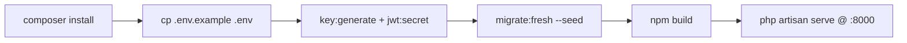
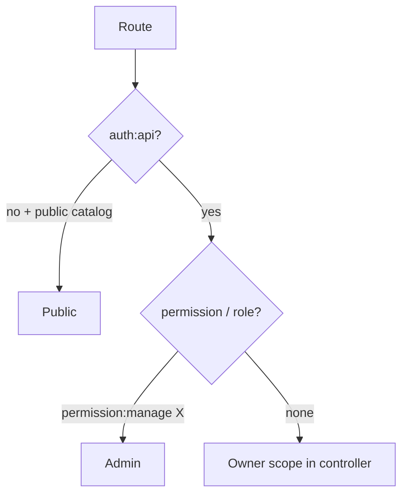

# Conference Platform — Team 2 · Backend API

> **Laravel 12 API** for Itinera — travel/trip planning where members build itineraries, get AI reviews, subscribe to plans, and pay via PayMob. Full admin panel, 237 routes, JWT + RBAC, Scramble docs.

> **References**
> - [routes/api.php](file://routes/api.php#L1-L499) — 237 routes
> - [app/Http/Controllers](file://app/Http/Controllers) — 49 controllers
> - [app/Services](file://app/Services) — 28 services incl. GroqService, PaymobGateway
> - [config/scramble.php](file://config/scramble.php#L1-L20)
> - [composer.json](file://composer.json#L8-L23) — Laravel 12, tymon/jwt-auth, spatie/permission, Groq, PayMob

## Table of Contents

1. [Tech Stack](#tech-stack)
2. [Getting Started](#getting-started)
3. [Tests](#tests)
4. [Documentation](#documentation)
5. [API at a Glance](#api-at-a-glance)
6. [Authorization Model](#authorization-model)
7. [Security Notes](#security-notes)

## Tech Stack

| Layer | Choice | Source |
|---|---|---|
| Framework | Laravel 12 (PHP 8.2+) | [composer.json](file://composer.json#L12-L14) |
| Auth | `tymon/jwt-auth` (JWT bearer, refresh rotation) | [config/jwt.php](file://config/jwt.php#L10-L20) |
| Authorization | `spatie/laravel-permission` (roles + permission middleware) | [database/seeders/RoleAndPermissionSeeder.php](file://database/seeders/RoleAndPermissionSeeder.php#L10-L40) |
| Payments | PayMob checkout (hosted page, webhook + callback, HMAC) | [app/Services/Commerce/PaymobGateway.php](file://app/Services/Commerce/PaymobGateway.php#L1-L30) |
| AI reviews | Groq (`lucianotonet/groq-laravel`, `llama-3.1-8b-instant`) | [app/Services/GroqService.php](file://app/Services/GroqService.php#L18-L60) |
| Reports | `barryvdh/laravel-dompdf` + `openspout` | [app/Services/System/GenerateReportService.php](file://app/Services/System/GenerateReportService.php#L1-L30) |
| API docs | `dedoc/scramble` (OpenAPI UI at `/docs/api`) | [config/scramble.php](file://config/scramble.php#L1-L20) |
| Queue / cache | Redis (`predis` pure-PHP, no ext on PHP 8.5) | [Dockerfile — no ext-redis](file://../../Dockerfile#L85-L87) |
| Dev | Telescope, Mail preview, Sail, Pint | [composer.json require-dev](file://composer.json#L24-L30) |

**Section sources:** [composer.json](file://composer.json#L8-L30) · [Dockerfile](file://../../Dockerfile#L27-L87)

## Getting Started

### Prerequisites

* PHP 8.2+, Composer, Node 20+ (Vite), MySQL (or SQLite) + Redis (or Sail Docker)

### Install & Seed

```bash
composer install
cp .env.example .env        # copy .env.example .env on Linux/macOS — Windows: copy
```

Complete `.env` (DB, `JWT_SECRET`, PayMob keys `PAYMOB_PUBLIC_KEY/SECRET/HMAC`, Groq `GROQ_API_KEY`, Redis), then:

```bash
# one-shot (keys, storage link, migrate:fresh --seed, build assets)
composer run setup

# or step by step
php artisan key:generate
php artisan jwt:secret --force
php artisan storage:link
php artisan migrate:fresh --seed --force
npm install && npm run build
```

Seeder installs roles (`super_admin`, `admin`, `user`, `agency`), all route permissions (guard `api`), default admin, plans, and catalog fixtures (hotels, flights 3,502 rows, restaurants, attractions).



**Section sources:** [composer.json scripts.setup](file://composer.json#L45-L53) · [database/seeders/DatabaseSeeder.php](file://database/seeders/DatabaseSeeder.php#L1-L30)

**Diagram sources:** Setup flow derived from `composer.json` scripts + `.env.example`.

### Run

```bash
composer run dev   # serve + queue:listen + pail logs + vite — concurrent
# or: php artisan serve (api) + php artisan queue:work (reports)
```

Base API: `http://127.0.0.1:8000/api` · Docs: `http://127.0.0.1:8000/docs/api` · OpenAPI JSON: `/docs/api.json`

## Tests

```bash
composer test       # config:clear + php artisan test
php artisan test --filter=ReportTest
```

Suite covers feature + unit for surveys, plans/subscriptions, checkout/PayMob, trips, permission guards (52 test classes, 55 files).

**Section sources:** [tests/Feature](file://tests/Feature) · [.github/workflows/ci.yml](file://../../.github/workflows/ci.yml#L27-L48)

## Documentation

| Doc | What it is |
|---|---|
| [docs/Conference-API-Documentation.md](docs/Conference-API-Documentation.md) | Endpoint reference — 237 routes in 36 modules, method/path/access/description (PDF-styled) |
| [docs/Conference-API-Documentation.pdf](docs/Conference-API-Documentation.pdf) | Branded A4 PDF (confidential footer) |
| [docs/ROUTES-PERMISSIONS-AUDIT.md](docs/ROUTES-PERMISSIONS-AUDIT.md) | Route × permission audit (237 routes), gaps & owner checks |
| [docs/DEPLOYMENT.md](docs/DEPLOYMENT.md) · [docs/ENVIRONMENT.md](docs/ENVIRONMENT.md) | Ops + env reference |
| [docs/payment-final-audit.md](docs/payment-final-audit.md) · [docs/notifications-architecture-research.md](docs/notifications-architecture-research.md) | Deep-dives |
| `/docs/api` | Live Scramble OpenAPI |
| `postman_collection.json` | Importable Postman (114+ requests) |

## API at a Glance

* **Public:** register, login, forgot/reset password, catalog browse (categories, destinations, hotels, flights, restaurants, attractions), weather, site settings, contact form, PayMob webhook/callback, docs.
* **Member (`USER`):** profile, trips (CRUD + attach/detach + fork), AI itinerary review, favourites & reviews, surveys, plans & subscription (subscribe/upgrade/cancel), checkout `POST api/v1/checkout/initiate`, dashboard, notifications, my reports.
* **Operators (`ADMIN`):** `api/v1/admin/*` — users, trips, catalog CRUD, countries, reviews moderation, contacts inbox, settings, analytics, reports, plans, notifications broadcast.

## Authorization Model

* `auth:api` middleware on every protected route (JWT bearer).
* `permission:...` middleware for operator CRUD and member plan flows (20 seeded permissions, exact-string match).
* `role:admin|super_admin` on reports + admin notifications.
* Owner-scoped queries (surveys, notifications, reviews, favourites, reports) — see audit doc for matrix (gaps #1-#3 tracked there).



**Section sources:** [routes/api.php](file://routes/api.php#L56-L120) · [ROUTES-PERMISSIONS-AUDIT.md](docs/ROUTES-PERMISSIONS-AUDIT.md#2-verification-status-per-category)

**Diagram sources:** Authorization flowchart derived from `routes/api.php` middleware chains.

## Security Notes

* Email verification via signed URLs (`MustVerifyEmail`).
* Throttles: `login` (5/60s), `register`, `refresh` (15/1m), `forgot-password` (3/10m), `reset-password` (5/1m), `email/resend` (6/1m), `weather`, `ai`.
* PayMob webhook validated by HMAC SHA-512 before fulfilment; production fail-fast if `PAYMOB_HMAC` empty.
* Remaining flagged items (dead `attach`/`detach` routes, missing owner check on `/api/review/{id}` and `/api/v1/maps/trip`, contacts throttle) are tracked in `docs/ROUTES-PERMISSIONS-AUDIT.md` (§3).

**Section sources:** [app/Http/Middleware](file://app/Http/Middleware) · [ROUTES-PERMISSIONS-AUDIT.md](docs/ROUTES-PERMISSIONS-AUDIT.md#3-gaps-found-ordered)

---

MIT — internal case-study deliverable, Team 2.
