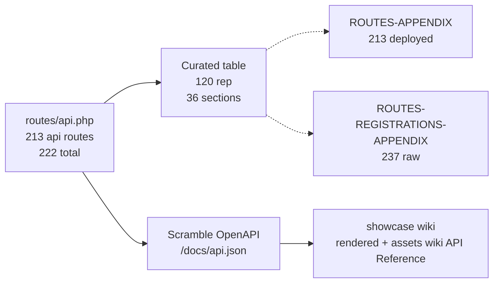

# Itinera API Reference — 213 `api/*` routes

> **213 `api/*` routes** (222 total incl. web/docs/storage/up, 237 `Route::` registrations before expansion) — audited `php artisan route:list --json` (499 lines in `routes/api.php`, 2026-08-23). Curated 120 representative endpoints across 36 sections below; full table at [`ROUTES-APPENDIX.md`](ROUTES-APPENDIX.md).

> **References**
> - [routes/api.php](file://routes/api.php#L1-L499) — 237 registrations → 213 deployed `api/*`, 49 controllers, 28 services
> - [app/Http/Controllers](file://app/Http/Controllers) — Account/Catalog/Trips/AI/Commerce/Chat/System/Admin
> - [ROUTES-APPENDIX.md](file://fullstack/Backend/docs/ROUTES-APPENDIX.md) — full 213-row table
> - [.repowiki API Reference](file://.repowiki/en/content/API%20Reference.md) — cited guide

## Table of Contents

1. [Authentication](#1-authentication) (9)
2. [Profile & Account](#2-profile--account) (2)
3. [Catalog — Categories](#3-catalog--categories) (2)
4. [Catalog — Destinations](#4-catalog--destinations) (2)
5. [Catalog — Hotels](#5-catalog--hotels) (2)
6. [Catalog — Flights](#6-catalog--flights) (2)
7. [Catalog — Restaurants](#7-catalog--restaurants) (2)
8. [Catalog — Attractions](#8-catalog--attractions) (2)
9. [Site & Utilities](#9-site--utilities) (3)
10. [Maps](#10-maps) (2)
11. [Trips](#11-trips) (6)
12. [AI Itinerary Review](#12-ai-itinerary-review) (2)
13. [Favourites & Member Reviews](#13-favourites--member-reviews) (3)
14. [Surveys](#14-surveys) (5)
15. [Plans & Subscription](#15-plans--subscription) (5)
16. [Dashboard](#16-dashboard) (3)
17. [Notifications](#17-notifications) (3)
18. [Checkout & Payments](#18-checkout--payments) (3)
19. [My Reports](#19-my-reports) (1)
20. [Admin — Users](#20-admin--users) (6)
21. [Admin — Trips](#21-admin--trips) (4)
22. [Admin — Categories](#22-admin--categories) (4)
23. [Admin — Countries](#23-admin--countries) (4)
24. [Admin — Destinations](#24-admin--destinations) (4)
25. [Admin — Hotels](#25-admin--hotels) (4)
26. [Admin — Flights](#26-admin--flights) (4)
27. [Admin — Restaurants](#27-admin--restaurants) (4)
28. [Admin — Attractions](#28-admin--attractions) (4)
29. [Admin — Reviews](#29-admin--reviews) (4)
30. [Admin — Contacts](#30-admin--contacts) (3)
31. [Admin — Plans](#31-admin--plans) (1)
32. [Admin — Reports](#32-admin--reports) (3)
33. [Admin — Settings](#33-admin--settings) (3)
34. [Admin — Analytics](#34-admin--analytics) (2)
35. [Admin — Notifications](#35-admin--notifications) (1)
36. [Developer & Operations](#36-developer--operations) (6)

**Section sources:** [routes/api.php](file://routes/api.php) · [ROUTES-PERMISSIONS-AUDIT.md](ROUTES-PERMISSIONS-AUDIT.md)

---

### 1. Authentication

| # | Method | Endpoint | Access | Description |
|---|---|---|---|---|
| 1 | `POST` | `api/register` | — | Create a member account: name, email, password. Email verification flow triggered. Throttle: register. |
| 2 | `POST` | `api/login` | — | Authenticate credentials; returns JWT access token (Bearer). Throttle: login (5/60s). |
| 3 | `POST` | `api/refresh` | USER | Rotate expired access token. Throttle: 15/1min. |
| 4 | `POST` | `api/logout` | USER | Invalidate current access token. |
| 5 | `POST` | `api/forgot-password` | — | Send password reset link to email. Throttle: 3/10min. |
| 6 | `POST` | `api/reset-password` | — | Apply new password with emailed token. Throttle: 5/1min. |
| 7 | `POST` | `api/email/resend` | USER | Resend email verification link. Throttle: 6/1min. |
| 8 | `GET` | `api/email/verify-notice` | USER | Flag/notice page after registration before verification. |
| 9 | `GET` | `api/email/verify/{id}/{hash}` | — | Verify email via signed URL (Laravel signed routes — tamper-proof). |

### 2. Profile & Account

| # | Method | Endpoint | Access | Description |
|---|---|---|---|---|
| 1 | `GET` | `api/user` | USER | Current authenticated profile. |
| 2 | `PATCH` | `api/v1/profile` | USER | Update own profile: name, phone, photo, etc. |

### 3. Catalog — Categories

| # | Method | Endpoint | Access | Description |
|---|---|---|---|---|
| 1 | `GET` | `api/v1/categories` | — | List travel categories (beaches, mountains, ...). |
| 2 | `GET` | `api/v1/categories/{category}` | — | Single category with stats. |

### 4. Catalog — Destinations

| # | Method | Endpoint | Access | Description |
|---|---|---|---|---|
| 1 | `GET` | `api/v1/destinations` | — | Browse destinations. Search/filter/pagination. |
| 2 | `GET` | `api/v1/destinations/{id}` | — | Destination detail incl. related hotels, restaurants, attractions. |

### 5. Catalog — Hotels

| # | Method | Endpoint | Access | Description |
|---|---|---|---|---|
| 1 | `GET` | `api/v1/hotels` | — | List hotels. Location/price filters; paginated. |
| 2 | `GET` | `api/v1/hotels/{id}` | — | Hotel detail: rating, price, amenities. |

### 6. Catalog — Flights

| # | Method | Endpoint | Access | Description |
|---|---|---|---|---|
| 1 | `GET` | `api/v1/flights` | — | List flights. Origin/destination/date filters; paginated. |
| 2 | `GET` | `api/v1/flights/{id}` | — | Flight detail: airline, times, price, class. |

### 7. Catalog — Restaurants

| # | Method | Endpoint | Access | Description |
|---|---|---|---|---|
| 1 | `GET` | `api/v1/restaurants` | — | List restaurants. Cuisine/price filters; paginated. |
| 2 | `GET` | `api/v1/restaurants/{id}` | — | Restaurant detail: cuisine, price range, photos. |

### 8. Catalog — Attractions

| # | Method | Endpoint | Access | Description |
|---|---|---|---|---|
| 1 | `GET` | `api/v1/attractions` | — | List attractions. Category/destination filters; paginated. |
| 2 | `GET` | `api/v1/attractions/{id}` | — | Attraction detail: description, hours, entry info. |

### 9. Site & Utilities

| # | Method | Endpoint | Access | Description |
|---|---|---|---|---|
| 1 | `GET` | `api/v1/site-settings` | — | Public site settings (branding, contact info). Whitelisted keys only. |
| 2 | `GET` | `api/weather` | — | Weather lookup for destinations (external weather provider). |
| 3 | `POST` | `api/v1/contacts` | — | Contact form submission: name, email, subject, message. |

### 10. Maps

| # | Method | Endpoint | Access | Description |
|---|---|---|---|---|
| 1 | `GET` | `api/v1/maps/destination/{destination}` | — | Map markers for a destination (hotels/restaurants/attractions). |
| 2 | `GET` | `api/v1/maps/trip/{trip}` | USER | Map data for a member trip. |

### 11. Trips

| # | Method | Endpoint | Access | Description |
|---|---|---|---|---|
| 1 | `GET` | `api/v1/trips/create` | USER | Trip builder bootstrap: list of selectable hotels etc. |
| 2 | `POST` | `api/v1/trips` | USER | Create a trip: destination, dates, budget, companions, hotel plan. |
| 3 | `GET` | `api/v1/trips/{trip}` | USER | Trip detail with itinerary lines (hotel, flights, restaurants, attractions). |
| 4 | `POST` | `api/trips/{trip}/fork` | USER | Copy another member's trip into own collection (trip forking). |
| 5 | `POST` | `api/v1/trips/{trip}/attach/{type}` | USER | Attach an entity (hotel/flight/restaurant/attraction) to trip. |
| 6 | `DELETE` | `api/v1/trips/{trip}/detach/{id}` | USER | Detach an entity from trip. |

### 12. AI Itinerary Review

| # | Method | Endpoint | Access | Description |
|---|---|---|---|---|
| 1 | `POST` | `api/review` | USER | Generate AI itinerary/review for a trip. |
| 2 | `GET` | `api/review/{id}` | USER | Fetch generated AI review. |

### 13. Favourites & Member Reviews

| # | Method | Endpoint | Access | Description |
|---|---|---|---|---|
| 1 | `POST` | `api/v1/favourites/{type}/{id}` | USER | Add/remove favourite for entity (destinations, hotels...). |
| 2 | `POST` | `api/v1/reviews/{type}/{id}` | USER | Post a rating + review for entity. |
| 3 | `DELETE` | `api/v1/reviews/{id}` | USER | Delete own review (owner scoped). |

### 14. Surveys

| # | Method | Endpoint | Access | Description |
|---|---|---|---|---|
| 1 | `GET` | `api/surveys` | USER | List own surveys. |
| 2 | `POST` | `api/surveys` | USER | Submit a survey response. |
| 3 | `GET` | `api/surveys/{survey}` | USER | View one of own surveys (owner-scoped). |
| 4 | `PUT` | `api/surveys/{survey}` | USER | Update own survey (owner-scoped). |
| 5 | `DELETE` | `api/surveys/{survey}` | USER | Delete own survey (owner-scoped). |

### 15. Plans & Subscription

| # | Method | Endpoint | Access | Description |
|---|---|---|---|---|
| 1 | `GET` | `api/v1/plans` | USER | List available plans (perm: get plans). |
| 2 | `POST` | `api/v1/me/subscribe` | USER | Subscribe to a plan (perm: subscribe to plans). |
| 3 | `POST` | `api/v1/me/upgrade` | USER | Upgrade current plan (perm: upgrade plans). |
| 4 | `POST` | `api/v1/me/subscription/cancel` | USER | Cancel subscription (perm: cancel subscription). |
| 5 | `GET` | `api/v1/me/subscription` | USER | Current subscription details (perm: view my subscription). |

### 16. Dashboard

| # | Method | Endpoint | Access | Description |
|---|---|---|---|---|
| 1 | `GET` | `api/v1/dashboard` | USER | Member dashboard aggregate: stats, recent trips, upcoming, recommendations. |
| 2 | `GET` | `api/v1/dashboard/trips` | USER | Paged member trips for dashboard. |
| 3 | `GET` | `api/v1/dashboard/favourites` | USER | Paged member favourites for dashboard. |

### 17. Notifications

| # | Method | Endpoint | Access | Description |
|---|---|---|---|---|
| 1 | `GET` | `api/v1/notifications` | USER | My notifications; unread_count included. Filter: ?unread_only=. |
| 2 | `PATCH` | `api/v1/notifications/read-all` | USER | Mark all my notifications read. |
| 3 | `PATCH` | `api/v1/notifications/{notification}/read` | USER | Mark one notification read (ownership checked). |

### 18. Checkout & Payments

| # | Method | Endpoint | Access | Description |
|---|---|---|---|---|
| 1 | `POST` | `api/v1/checkout/initiate` | USER | Start PayMob checkout for subscription/plan payment; returns payment token & URL. |
| 2 | `POST` | `api/v1/paymob/webhook` | — | PayMob webhook; transaction verified by signature before fulfilment. |
| 3 | `GET` | `api/v1/paymob/callback` | — | PayMob redirect landing; HMAC re-checked; stateless. |

### 19. My Reports

| # | Method | Endpoint | Access | Description |
|---|---|---|---|---|
| 1 | `GET` | `api/me/reports` | USER | List own reports (poll `pending` → `completed`); download via `GET /reports/{id}/download` when completed. |

### 20. Admin — Users

| # | Method | Endpoint | Access | Description |
|---|---|---|---|---|
| 1 | `GET` | `api/v1/admin/users` | ADMIN | List users (perm: manage users). |
| 2 | `POST` | `api/v1/admin/users` | ADMIN | Create user. |
| 3 | `GET` | `api/v1/admin/users/{user}` | ADMIN | Show user. |
| 4 | `PUT` | `api/v1/admin/users/{user}` | ADMIN | Update user. |
| 5 | `PATCH` | `api/v1/admin/users/{user}/active` | ADMIN | Activate user. |
| 6 | `PATCH` | `api/v1/admin/users/{user}/block` | ADMIN | Block user. |

### 21. Admin — Trips

| # | Method | Endpoint | Access | Description |
|---|---|---|---|---|
| 1 | `GET` | `api/v1/admin/trips` | ADMIN | List all trips. |
| 2 | `POST` | `api/v1/admin/trips` | ADMIN | Create trip (admin). |
| 3 | `PUT` | `api/v1/admin/trips/{id}` | ADMIN | Update trip. |
| 4 | `DELETE` | `api/v1/admin/trips/{id}` | ADMIN | Delete trip. |

### 22. Admin — Categories

| # | Method | Endpoint | Access | Description |
|---|---|---|---|---|
| 1 | `GET` | `api/v1/admin/categories` | ADMIN | List categories. |
| 2 | `POST` | `api/v1/admin/categories` | ADMIN | Create category. |
| 3 | `PUT` | `api/v1/admin/categories/{category}` | ADMIN | Update category. |
| 4 | `DELETE` | `api/v1/admin/categories/{category}` | ADMIN | Delete category. |

### 23. Admin — Countries

| # | Method | Endpoint | Access | Description |
|---|---|---|---|---|
| 1 | `GET` | `api/v1/admin/countries` | ADMIN | List countries. |
| 2 | `POST` | `api/v1/admin/countries` | ADMIN | Create country. |
| 3 | `PUT` | `api/v1/admin/countries/{id}` | ADMIN | Update country. |
| 4 | `DELETE` | `api/v1/admin/countries/{id}` | ADMIN | Delete country. |

### 24. Admin — Destinations

| # | Method | Endpoint | Access | Description |
|---|---|---|---|---|
| 1 | `GET` | `api/v1/admin/destinations` | ADMIN | List destinations. |
| 2 | `POST` | `api/v1/admin/destinations` | ADMIN | Create destination. |
| 3 | `PUT` | `api/v1/admin/destinations/{id}` | ADMIN | Update destination. |
| 4 | `DELETE` | `api/v1/admin/destinations/{id}` | ADMIN | Delete destination. |

### 25. Admin — Hotels

| # | Method | Endpoint | Access | Description |
|---|---|---|---|---|
| 1 | `GET` | `api/v1/admin/hotels` | ADMIN | List hotels. |
| 2 | `POST` | `api/v1/admin/hotels` | ADMIN | Create hotel. |
| 3 | `PUT` | `api/v1/admin/hotels/{id}` | ADMIN | Update hotel. |
| 4 | `DELETE` | `api/v1/admin/hotels/{id}` | ADMIN | Delete hotel. |

### 26. Admin — Flights

| # | Method | Endpoint | Access | Description |
|---|---|---|---|---|
| 1 | `GET` | `api/v1/admin/flights` | ADMIN | List flights. |
| 2 | `POST` | `api/v1/admin/flights` | ADMIN | Create flight. |
| 3 | `PUT` | `api/v1/admin/flights/{id}` | ADMIN | Update flight. |
| 4 | `DELETE` | `api/v1/admin/flights/{id}` | ADMIN | Delete flight. |

### 27. Admin — Restaurants

| # | Method | Endpoint | Access | Description |
|---|---|---|---|---|
| 1 | `GET` | `api/v1/admin/restaurants` | ADMIN | List restaurants. |
| 2 | `POST` | `api/v1/admin/restaurants` | ADMIN | Create restaurant. |
| 3 | `PUT` | `api/v1/admin/restaurants/{id}` | ADMIN | Update restaurant. |
| 4 | `DELETE` | `api/v1/admin/restaurants/{id}` | ADMIN | Delete restaurant. |

### 28. Admin — Attractions

| # | Method | Endpoint | Access | Description |
|---|---|---|---|---|
| 1 | `GET` | `api/v1/admin/attractions` | ADMIN | List attractions. |
| 2 | `POST` | `api/v1/admin/attractions` | ADMIN | Create attraction. |
| 3 | `PUT` | `api/v1/admin/attractions/{id}` | ADMIN | Update attraction. |
| 4 | `DELETE` | `api/v1/admin/attractions/{id}` | ADMIN | Delete attraction. |

### 29. Admin — Reviews

| # | Method | Endpoint | Access | Description |
|---|---|---|---|---|
| 1 | `GET` | `api/v1/admin/reviews` | ADMIN | List reviews. |
| 2 | `DELETE` | `api/v1/admin/reviews/{id}` | ADMIN | Delete review. |
| 3 | `PATCH` | `api/v1/admin/reviews/{id}/approve` | ADMIN | Approve review. |
| 4 | `PATCH` | `api/v1/admin/reviews/{id}/reject` | ADMIN | Reject review. |

### 30. Admin — Contacts

| # | Method | Endpoint | Access | Description |
|---|---|---|---|---|
| 1 | `GET` | `api/v1/admin/contacts` | ADMIN | List contact messages. |
| 2 | `PATCH` | `api/v1/admin/contacts/{id}/read` | ADMIN | Mark contact read. |
| 3 | `PATCH` | `api/v1/admin/contacts/{id}/resolve` | ADMIN | Mark contact resolved. |

### 31. Admin — Plans

| # | Method | Endpoint | Access | Description |
|---|---|---|---|---|
| 1 | `POST` | `api/v1/admin/set-plans` | ADMIN | Set/overwrite plans (manage plans). |

### 32. Admin — Reports

| # | Method | Endpoint | Access | Description |
|---|---|---|---|---|
| 1 | `GET` | `api/v1/admin/reports` | ADMIN | List all reports. |
| 2 | `POST` | `api/v1/admin/reports/generate` | ADMIN | Generate report (202 pending → queue). |
| 3 | `GET` | `api/v1/admin/reports/{id}/download` | ADMIN | Download completed report PDF. |

### 33. Admin — Settings

| # | Method | Endpoint | Access | Description |
|---|---|---|---|---|
| 1 | `GET` | `api/v1/admin/settings` | ADMIN | List site settings. |
| 2 | `PUT` | `api/v1/admin/settings` | ADMIN | Update settings. |
| 3 | `PATCH` | `api/v1/admin/settings/{key}` | ADMIN | Patch single setting. |

### 34. Admin — Analytics

| # | Method | Endpoint | Access | Description |
|---|---|---|---|---|
| 1 | `GET` | `api/v1/admin/analytics` | ADMIN | Analytics overview (users, revenue). |
| 2 | `GET` | `api/v1/admin/analytics/revenue` | ADMIN | Revenue analytics + recent bookings. |

### 35. Admin — Notifications

| # | Method | Endpoint | Access | Description |
|---|---|---|---|---|
| 1 | `GET` | `api/v1/admin/notifications` | ADMIN | List platform notifications. |

### 36. Developer & Operations

| # | Method | Endpoint | Access | Description |
|---|---|---|---|---|
| 1 | `GET` | `api/v1/admin/notifications` | ADMIN | (duplicate — see 35) |
| 2 | `GET` | `docs/api` | — | Scramble OpenAPI UI (RestrictedDocsAccess). |
| 3 | `GET` | `docs/api.json` | — | OpenAPI JSON (for Apidog/Postman). |
| 4 | `GET` | `up` | — | Health probe. |
| 5 | `GET` | `storage/{path}` | — | File serve (local disk). |
| 6 | `PUT` | `storage/{path}` | — | File upload (local). |

---

## Appendix — Full Route Lists

> **213 deployed `api/*`** (222 total) — full deployed table at [`ROUTES-APPENDIX.md`](ROUTES-APPENDIX.md) (213 rows, `route:list --json`, 2026-08-23).

> **237 raw registrations** — full raw `Route::` table at [`ROUTES-REGISTRATIONS-APPENDIX.md`](ROUTES-REGISTRATIONS-APPENDIX.md) (237 lines, includes wrappers).

**Section sources:** [routes/api.php](file://routes/api.php) · [ROUTES-PERMISSIONS-AUDIT.md](ROUTES-PERMISSIONS-AUDIT.md) · [ROUTES-APPENDIX.md](ROUTES-APPENDIX.md) · [ROUTES-REGISTRATIONS-APPENDIX.md](ROUTES-REGISTRATIONS-APPENDIX.md)
