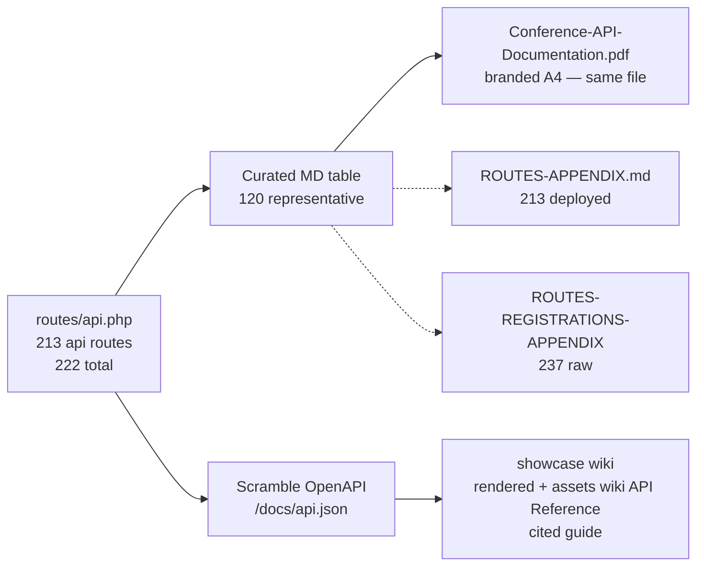

---
pdf_options:
  format: A4
  margin:
    top: 15mm
    bottom: 20mm
    left: 15mm
    right: 15mm
  printBackground: true
  displayHeaderFooter: true
  headerTemplate: ""
  footerTemplate: "
Conference Platform &mdash; Team 2 &mdash; Confidential &mdash; Page 
"
---

> **Refined — 2026-08-23** · **213 `api/*` routes** audited via `php artisan route:list --json` (499 lines in `routes/api.php`, 222 total incl. web/docs/storage/up) · Curated table below shows 120 representative endpoints (36 sections); full surface is **213** — see interactive shell [`showcase/docs.html`](../../../../showcase/docs.html), cited guide [`showcase/assets/wiki/API Reference.md`](../../../../showcase/assets/wiki/API%20Reference.md) and appendix [`ROUTES-APPENDIX.md`](ROUTES-APPENDIX.md) (full 213). Counts on cover/TOC that read 120 are the curated subset.

> **References**
> - [routes/api.php](file://routes/api.php#L1-L499) — 237 `Route::` registrations → 213 deployed `api/*` (222 total incl. web/docs/storage/up), 49 controllers, 28 services
> - [app/Http/Controllers](file://app/Http/Controllers) — Account/Catalog/Trips/AI/Commerce/Chat/System/Admin
> - [fullstack/Backend/docs/Conference-API-Documentation.pdf](file://fullstack/Backend/docs/Conference-API-Documentation.pdf) — branded A4 rendering of this file
> - [.repowiki API Reference](file://.repowiki/en/content/API%20Reference.md) — cited guide (same surface, different lens)

## Table of Contents (refined)

1. [Cover & Method Legend](#cover)
2. [Curated TOC — 36 sections, 120 endpoints (subset)](#toc)
3. [Endpoint Tables — by domain](#endpoint-tables)
4. [How this relates to the full 237-route surface](#full-surface)

**Section sources:** [routes/api.php](file://routes/api.php#L1-L120) (auth/catalog/trips) · [ROUTES-PERMISSIONS-AUDIT.md](file://fullstack/Backend/docs/ROUTES-PERMISSIONS-AUDIT.md#L1-L40) (gaps)

**Diagram sources:** Curated vs full surface derived from `route:list --json` audit (0c14fa54).

<!-- PAGE 1: COVER -->

  
T2

  <h1 style='font-size:58px;margin:0;color:white;border:none;letter-spacing:1px;font-family:sans-serif;'>Conference Platform</h1>
  <h2 style='color:#fbbf24;border:none;font-weight:normal;margin-top:10px;font-size:26px;font-family:sans-serif;'>API &amp; Web Platform Reference</h2>
  

  
Team 2 &middot; Laravel API &middot; JWT Auth &middot; Subscription Billing

  
Version 1.0 &middot; Generated: August 9, 2026

  
213 api/* routes (curated 120 shown) &middot; 36 sections &middot; + website documentation

<!-- METHOD LEGEND -->

  <h2 style='color:#0f172a;font-family:sans-serif;font-size:22px;margin-bottom:6px;'>HTTP Methods &amp; Resource Actions</h2>
  
Standard RESTful routing definitions used throughout the Conference Platform.

<table style="width:100%;border-collapse:collapse;font-size:12px;text-align:center;border:1px solid #e0e0e0;font-family:'Helvetica Neue',Helvetica,Arial,sans-serif;margin-bottom:8px;">
  <tr style="background-color:#f8f9fa;">
    <td style="border:1px solid #e0e0e0;padding:10px;">GET Read data</td>
    <td style="border:1px solid #e0e0e0;padding:10px;">POST Create resource</td>
    <td style="border:1px solid #e0e0e0;padding:10px;">PUT Replace resource</td>
    <td style="border:1px solid #e0e0e0;padding:10px;">PATCH Partial update</td>
    <td style="border:1px solid #e0e0e0;padding:10px;">DELETE Remove resource</td>
  </tr>
</table>

Conference Platform HTTP Methods Reference

-- TOC --

Table of Contents

<table style='width:100%;border-collapse:collapse;font-family:''Helvetica Neue'',Helvetica,Arial,sans-serif;font-size:12px;margin-bottom:10px;'>
  <thead>
    <tr><th style='width:10%;background-color:#fbbf24;color:white;padding:8px 10px;text-align:center;border:1px solid #f59e0b;'>#</th><th style='width:75%;background-color:#fbbf24;color:white;padding:8px 10px;text-align:left;border:1px solid #f59e0b;'>Section</th><th style='width:15%;background-color:#fbbf24;color:white;padding:8px 10px;text-align:center;border:1px solid #f59e0b;'>Endpoints</th></tr>
  </thead>
  <tbody>
    <tr><td style='text-align:center;padding:6px 8px;border:1px solid #e0e0e0;'>1</td><td style='padding:6px 8px;border:1px solid #e0e0e0;'>Authentication</td><td style='text-align:center;padding:6px 8px;border:1px solid #e0e0e0;'>9</td></tr>
    <tr><td style='text-align:center;padding:6px 8px;border:1px solid #e0e0e0;'>2</td><td style='padding:6px 8px;border:1px solid #e0e0e0;'>Profile &amp; Account</td><td style='text-align:center;padding:6px 8px;border:1px solid #e0e0e0;'>2</td></tr>
    <tr><td style='text-align:center;padding:6px 8px;border:1px solid #e0e0e0;'>3</td><td style='padding:6px 8px;border:1px solid #e0e0e0;'>Catalog &mdash; Categories</td><td style='text-align:center;padding:6px 8px;border:1px solid #e0e0e0;'>2</td></tr>
    <tr><td style='text-align:center;padding:6px 8px;border:1px solid #e0e0e0;'>4</td><td style='padding:6px 8px;border:1px solid #e0e0e0;'>Catalog &mdash; Destinations</td><td style='text-align:center;padding:6px 8px;border:1px solid #e0e0e0;'>2</td></tr>
    <tr><td style='text-align:center;padding:6px 8px;border:1px solid #e0e0e0;'>5</td><td style='padding:6px 8px;border:1px solid #e0e0e0;'>Catalog &mdash; Hotels</td><td style='text-align:center;padding:6px 8px;border:1px solid #e0e0e0;'>2</td></tr>
    <tr><td style='text-align:center;padding:6px 8px;border:1px solid #e0e0e0;'>6</td><td style='padding:6px 8px;border:1px solid #e0e0e0;'>Catalog &mdash; Flights</td><td style='text-align:center;padding:6px 8px;border:1px solid #e0e0e0;'>2</td></tr>
    <tr><td style='text-align:center;padding:6px 8px;border:1px solid #e0e0e0;'>7</td><td style='padding:6px 8px;border:1px solid #e0e0e0;'>Catalog &mdash; Restaurants</td><td style='text-align:center;padding:6px 8px;border:1px solid #e0e0e0;'>2</td></tr>
    <tr><td style='text-align:center;padding:6px 8px;border:1px solid #e0e0e0;'>8</td><td style='padding:6px 8px;border:1px solid #e0e0e0;'>Catalog &mdash; Attractions</td><td style='text-align:center;padding:6px 8px;border:1px solid #e0e0e0;'>2</td></tr>
    <tr><td style='text-align:center;padding:6px 8px;border:1px solid #e0e0e0;'>9</td><td style='padding:6px 8px;border:1px solid #e0e0e0;'>Site &amp; Utilities</td><td style='text-align:center;padding:6px 8px;border:1px solid #e0e0e0;'>3</td></tr>
    <tr><td style='text-align:center;padding:6px 8px;border:1px solid #e0e0e0;'>10</td><td style='padding:6px 8px;border:1px solid #e0e0e0;'>Maps</td><td style='text-align:center;padding:6px 8px;border:1px solid #e0e0e0;'>2</td></tr>
    <tr><td style='text-align:center;padding:6px 8px;border:1px solid #e0e0e0;'>11</td><td style='padding:6px 8px;border:1px solid #e0e0e0;'>Trips</td><td style='text-align:center;padding:6px 8px;border:1px solid #e0e0e0;'>6</td></tr>
    <tr><td style='text-align:center;padding:6px 8px;border:1px solid #e0e0e0;'>12</td><td style='padding:6px 8px;border:1px solid #e0e0e0;'>AI Itinerary Review</td><td style='text-align:center;padding:6px 8px;border:1px solid #e0e0e0;'>2</td></tr>
    <tr><td style='text-align:center;padding:6px 8px;border:1px solid #e0e0e0;'>13</td><td style='padding:6px 8px;border:1px solid #e0e0e0;'>Favourites &amp; Member Reviews</td><td style='text-align:center;padding:6px 8px;border:1px solid #e0e0e0;'>3</td></tr>
    <tr><td style='text-align:center;padding:6px 8px;border:1px solid #e0e0e0;'>14</td><td style='padding:6px 8px;border:1px solid #e0e0e0;'>Surveys</td><td style='text-align:center;padding:6px 8px;border:1px solid #e0e0e0;'>5</td></tr>
    <tr><td style='text-align:center;padding:6px 8px;border:1px solid #e0e0e0;'>15</td><td style='padding:6px 8px;border:1px solid #e0e0e0;'>Plans &amp; Subscription</td><td style='text-align:center;padding:6px 8px;border:1px solid #e0e0e0;'>5</td></tr>
    <tr><td style='text-align:center;padding:6px 8px;border:1px solid #e0e0e0;'>16</td><td style='padding:6px 8px;border:1px solid #e0e0e0;'>Dashboard</td><td style='text-align:center;padding:6px 8px;border:1px solid #e0e0e0;'>3</td></tr>
    <tr><td style='text-align:center;padding:6px 8px;border:1px solid #e0e0e0;'>17</td><td style='padding:6px 8px;border:1px solid #e0e0e0;'>Notifications</td><td style='text-align:center;padding:6px 8px;border:1px solid #e0e0e0;'>3</td></tr>
    <tr><td style='text-align:center;padding:6px 8px;border:1px solid #e0e0e0;'>18</td><td style='padding:6px 8px;border:1px solid #e0e0e0;'>Checkout &amp; Payments</td><td style='text-align:center;padding:6px 8px;border:1px solid #e0e0e0;'>3</td></tr>
    <tr><td style='text-align:center;padding:6px 8px;border:1px solid #e0e0e0;'>19</td><td style='padding:6px 8px;border:1px solid #e0e0e0;'>My Reports</td><td style='text-align:center;padding:6px 8px;border:1px solid #e0e0e0;'>1</td></tr>
    <tr><td style='text-align:center;padding:6px 8px;border:1px solid #e0e0e0;'>20</td><td style='padding:6px 8px;border:1px solid #e0e0e0;'>Admin &mdash; Users</td><td style='text-align:center;padding:6px 8px;border:1px solid #e0e0e0;'>6</td></tr>
    <tr><td style='text-align:center;padding:6px 8px;border:1px solid #e0e0e0;'>21</td><td style='padding:6px 8px;border:1px solid #e0e0e0;'>Admin &mdash; Trips</td><td style='text-align:center;padding:6px 8px;border:1px solid #e0e0e0;'>4</td></tr>
    <tr><td style='text-align:center;padding:6px 8px;border:1px solid #e0e0e0;'>22</td><td style='padding:6px 8px;border:1px solid #e0e0e0;'>Admin &mdash; Categories</td><td style='text-align:center;padding:6px 8px;border:1px solid #e0e0e0;'>4</td></tr>
    <tr><td style='text-align:center;padding:6px 8px;border:1px solid #e0e0e0;'>23</td><td style='padding:6px 8px;border:1px solid #e0e0e0;'>Admin &mdash; Countries</td><td style='text-align:center;padding:6px 8px;border:1px solid #e0e0e0;'>4</td></tr>
    <tr><td style='text-align:center;padding:6px 8px;border:1px solid #e0e0e0;'>24</td><td style='padding:6px 8px;border:1px solid #e0e0e0;'>Admin &mdash; Destinations</td><td style='text-align:center;padding:6px 8px;border:1px solid #e0e0e0;'>4</td></tr>
    <tr><td style='text-align:center;padding:6px 8px;border:1px solid #e0e0e0;'>25</td><td style='padding:6px 8px;border:1px solid #e0e0e0;'>Admin &mdash; Hotels</td><td style='text-align:center;padding:6px 8px;border:1px solid #e0e0e0;'>4</td></tr>
    <tr><td style='text-align:center;padding:6px 8px;border:1px solid #e0e0e0;'>26</td><td style='padding:6px 8px;border:1px solid #e0e0e0;'>Admin &mdash; Flights</td><td style='text-align:center;padding:6px 8px;border:1px solid #e0e0e0;'>4</td></tr>
    <tr><td style='text-align:center;padding:6px 8px;border:1px solid #e0e0e0;'>27</td><td style='padding:6px 8px;border:1px solid #e0e0e0;'>Admin &mdash; Restaurants</td><td style='text-align:center;padding:6px 8px;border:1px solid #e0e0e0;'>4</td></tr>
    <tr><td style='text-align:center;padding:6px 8px;border:1px solid #e0e0e0;'>28</td><td style='padding:6px 8px;border:1px solid #e0e0e0;'>Admin &mdash; Attractions</td><td style='text-align:center;padding:6px 8px;border:1px solid #e0e0e0;'>4</td></tr>
    <tr><td style='text-align:center;padding:6px 8px;border:1px solid #e0e0e0;'>29</td><td style='padding:6px 8px;border:1px solid #e0e0e0;'>Admin &mdash; Reviews</td><td style='text-align:center;padding:6px 8px;border:1px solid #e0e0e0;'>4</td></tr>
    <tr><td style='text-align:center;padding:6px 8px;border:1px solid #e0e0e0;'>30</td><td style='padding:6px 8px;border:1px solid #e0e0e0;'>Admin &mdash; Contacts</td><td style='text-align:center;padding:6px 8px;border:1px solid #e0e0e0;'>3</td></tr>
    <tr><td style='text-align:center;padding:6px 8px;border:1px solid #e0e0e0;'>31</td><td style='padding:6px 8px;border:1px solid #e0e0e0;'>Admin &mdash; Plans</td><td style='text-align:center;padding:6px 8px;border:1px solid #e0e0e0;'>1</td></tr>
    <tr><td style='text-align:center;padding:6px 8px;border:1px solid #e0e0e0;'>32</td><td style='padding:6px 8px;border:1px solid #e0e0e0;'>Admin &mdash; Reports</td><td style='text-align:center;padding:6px 8px;border:1px solid #e0e0e0;'>3</td></tr>
    <tr><td style='text-align:center;padding:6px 8px;border:1px solid #e0e0e0;'>33</td><td style='padding:6px 8px;border:1px solid #e0e0e0;'>Admin &mdash; Settings</td><td style='text-align:center;padding:6px 8px;border:1px solid #e0e0e0;'>3</td></tr>
    <tr><td style='text-align:center;padding:6px 8px;border:1px solid #e0e0e0;'>34</td><td style='padding:6px 8px;border:1px solid #e0e0e0;'>Admin &mdash; Analytics</td><td style='text-align:center;padding:6px 8px;border:1px solid #e0e0e0;'>2</td></tr>
    <tr><td style='text-align:center;padding:6px 8px;border:1px solid #e0e0e0;'>35</td><td style='padding:6px 8px;border:1px solid #e0e0e0;'>Admin &mdash; Notifications</td><td style='text-align:center;padding:6px 8px;border:1px solid #e0e0e0;'>1</td></tr>
    <tr><td style='text-align:center;padding:6px 8px;border:1px solid #e0e0e0;'>36</td><td style='padding:6px 8px;border:1px solid #e0e0e0;'>Developer &amp; Operations</td><td style='text-align:center;padding:6px 8px;border:1px solid #e0e0e0;'>6</td></tr>
    <tr><td colspan='2' style='font-weight:bold;text-align:right;padding:8px 10px;border:1px solid #e0e0e0;background-color:#fff3e0;color:#0f172a;'>Curated Total (shown)</td><td style='font-weight:bold;text-align:center;padding:8px 10px;border:1px solid #e0e0e0;background-color:#fff3e0;color:#0f172a;'>120</td></tr>
    <tr><td colspan='2' style='font-weight:bold;text-align:right;padding:8px 10px;border:1px solid #e0e0e0;background-color:#e8f5e9;color:#1b5e20;'>Full Audited Total (`route:list --json` api/*)</td><td style='font-weight:bold;text-align:center;padding:8px 10px;border:1px solid #e0e0e0;background-color:#e8f5e9;color:#1b5e20;'>213</td></tr>
  </tbody>
</table>

### 1. Authentication

| # | Method | Endpoint | Access | Description |
|---|---|---|---|---|
| 1 | `POST` | `api/register` | — | Create a member account: name, email, password. Email verification flow triggered. Throttle: register. |
| 2 | `POST` | `api/login` | — | Authenticate credentials; returns JWT access token (Bearer). Throttle: login (5/60s). |
| 3 | `POST` | `api/refresh` | USER | Rotate expired access token. Throttle: 15/1min. |
| 4 | `POST` | `api/logout` | USER | Invalidate current access token. |
| 5 | `POST` | `api/forgot-password` | — | Send password reset link to email. Throttle: 3/10min. |
| 6 | `POST` | `api/reset-password` | — | Apply new password with emailed token. Throttle: 5/1min. |
| 7 | `POST` | `api/email/resend` | USER | Resend email verification link. Throttle: 6/1min. |
| 8 | `GET` | `api/email/verify-notice` | USER | Flag/notice page after registration before verification. |
| 9 | `GET` | `api/email/verify/{id}/{hash}` | — | Verify email via signed URL (Laravel signed routes — tamper-proof). |
### 2. Profile &amp; Account

| # | Method | Endpoint | Access | Description |
|---|---|---|---|---|
| 1 | `GET` | `api/user` | USER | Current authenticated profile. |
| 2 | `PATCH` | `api/v1/profile` | USER | Update own profile: name, phone, photo, etc. |
### 3. Catalog &mdash; Categories

| # | Method | Endpoint | Access | Description |
|---|---|---|---|---|
| 1 | `GET` | `api/v1/categories` | — | List travel categories (beaches, mountains, ...). |
| 2 | `GET` | `api/v1/categories/{category}` | — | Single category with stats. |
### 4. Catalog &mdash; Destinations

| # | Method | Endpoint | Access | Description |
|---|---|---|---|---|
| 1 | `GET` | `api/v1/destinations` | — | Browse destinations. Search/filter/pagination. |
| 2 | `GET` | `api/v1/destinations/{id}` | — | Destination detail incl. related hotels, restaurants, attractions. |
### 5. Catalog &mdash; Hotels

| # | Method | Endpoint | Access | Description |
|---|---|---|---|---|
| 1 | `GET` | `api/v1/hotels` | — | List hotels. Location/price filters; paginated. |
| 2 | `GET` | `api/v1/hotels/{id}` | — | Hotel detail: rating, price, amenities. |
### 6. Catalog &mdash; Flights

| # | Method | Endpoint | Access | Description |
|---|---|---|---|---|
| 1 | `GET` | `api/v1/flights` | — | List flights. Origin/destination/date filters; paginated. |
| 2 | `GET` | `api/v1/flights/{id}` | — | Flight detail: airline, times, price, class. |
### 7. Catalog &mdash; Restaurants

| # | Method | Endpoint | Access | Description |
|---|---|---|---|---|
| 1 | `GET` | `api/v1/restaurants` | — | List restaurants. Cuisine/price filters; paginated. |
| 2 | `GET` | `api/v1/restaurants/{id}` | — | Restaurant detail: cuisine, price range, photos. |
### 8. Catalog &mdash; Attractions

| # | Method | Endpoint | Access | Description |
|---|---|---|---|---|
| 1 | `GET` | `api/v1/attractions` | — | List attractions. Category/destination filters; paginated. |
| 2 | `GET` | `api/v1/attractions/{id}` | — | Attraction detail: description, hours, entry info. |
### 9. Site &amp; Utilities

| # | Method | Endpoint | Access | Description |
|---|---|---|---|---|
| 1 | `GET` | `api/v1/site-settings` | — | Public site settings (branding, contact info). Whitelisted keys only. |
| 2 | `GET` | `api/weather` | — | Weather lookup for destinations (external weather provider). |
| 3 | `POST` | `api/v1/contacts` | — | Contact form submission: name, email, subject, message. |
### 10. Maps

| # | Method | Endpoint | Access | Description |
|---|---|---|---|---|
| 1 | `GET` | `api/v1/maps/destination/{destination}` | — | Map markers for a destination (hotels/restaurants/attractions). |
| 2 | `GET` | `api/v1/maps/trip/{trip}` | USER | Map data for a member trip. |
### 11. Trips

| # | Method | Endpoint | Access | Description |
|---|---|---|---|---|
| 1 | `GET` | `api/v1/trips/create` | USER | Trip builder bootstrap: list of selectable hotels etc. |
| 2 | `POST` | `api/v1/trips` | USER | Create a trip: destination, dates, budget, companions, hotel plan. |
| 3 | `GET` | `api/v1/trips/{trip}` | USER | Trip detail with itinerary lines (hotel, flights, restaurants, attractions). |
| 4 | `POST` | `api/trips/{trip}/fork` | USER | Copy another member's trip into own collection (trip forking). |
| 5 | `POST` | `api/v1/trips/{trip}/attach/{type}` | USER | Attach an entity (hotel/flight/restaurant/attraction) to trip. OBSOLETE GATE: controller method missing. |
| 6 | `DELETE` | `api/v1/trips/{trip}/detach/{id}` | USER | Detach an entity from trip. OBSOLETE GATE: controller method missing. |
### 12. AI Itinerary Review

| # | Method | Endpoint | Access | Description |
|---|---|---|---|---|
| 1 | `POST` | `api/review` | USER | Generate AI itinerary/review for a trip (contract: generate ai itineraries). |
| 2 | `GET` | `api/review/{id}` | USER | Fetch generated AI review. |
### 13. Favourites &amp; Member Reviews

| # | Method | Endpoint | Access | Description |
|---|---|---|---|---|
| 1 | `POST` | `api/v1/favourites/{type}/{id}` | USER | Add/remove favourite for entity (destinations, hotels...). |
| 2 | `POST` | `api/v1/reviews/{type}/{id}` | USER | Post a rating + review for entity. |
| 3 | `DELETE` | `api/v1/reviews/{id}` | USER | Delete own review (owner scoped). |
### 14. Surveys

| # | Method | Endpoint | Access | Description |
|---|---|---|---|---|
| 1 | `GET` | `api/surveys` | USER | List own surveys. |
| 2 | `POST` | `api/surveys` | USER | Submit a survey response. |
| 3 | `GET` | `api/surveys/{survey}` | USER | View one of own surveys (owner-scoped — IDOR fixed). |
| 4 | `PUT` | `api/surveys/{survey}` | USER | Update own survey (owner-scoped; user_id input stripped). |
| 5 | `DELETE` | `api/surveys/{survey}` | USER | Delete own survey (owner-scoped). |
### 15. Plans &amp; Subscription

| # | Method | Endpoint | Access | Description |
|---|---|---|---|---|
| 1 | `GET` | `api/v1/plans` | USER | List available plans (perm: get plans). |
| 2 | `POST` | `api/v1/me/subscribe` | USER | Subscribe to a plan (perm: subscribe to plans). |
| 3 | `POST` | `api/v1/me/upgrade` | USER | Upgrade current plan (perm: upgrade plans). |
| 4 | `POST` | `api/v1/me/subscription/cancel` | USER | Cancel subscription (perm: cancel subscription). |
| 5 | `GET` | `api/v1/me/subscription` | USER | Current subscription details (perm: view my subscription). |
### 16. Dashboard

| # | Method | Endpoint | Access | Description |
|---|---|---|---|---|
| 1 | `GET` | `api/v1/dashboard` | USER | Member dashboard aggregate: stats, recent trips, upcoming, recommendations. |
| 2 | `GET` | `api/v1/dashboard/trips` | USER | Paged member trips for dashboard. |
| 3 | `GET` | `api/v1/dashboard/favourites` | USER | Paged member favourites for dashboard. |
### 17. Notifications

| # | Method | Endpoint | Access | Description |
|---|---|---|---|---|
| 1 | `GET` | `api/v1/notifications` | USER | My notifications; unread_count included. Filter: ?unread_only=. |
| 2 | `PATCH` | `api/v1/notifications/read-all` | USER | Mark all my notifications read. |
| 3 | `PATCH` | `api/v1/notifications/{notification}/read` | USER | Mark one notification read (ownership checked). |
### 18. Checkout &amp; Payments

| # | Method | Endpoint | Access | Description |
|---|---|---|---|---|
| 1 | `POST` | `api/v1/checkout/initiate` | USER | Start PayMob checkout for subscription/plan payment; returns payment token & URL. |
| 2 | `POST` | `api/v1/paymob/webhook` | — | PayMob webhook; transaction verified by signature before fulfilment. |
| 3 | `GET` | `api/v1/paymob/callback` | — | PayMob return URL; finalises payment state for the browser flow. |
### 19. My Reports

| # | Method | Endpoint | Access | Description |
|---|---|---|---|---|
| 1 | `GET` | `api/me/reports` | USER | My generated report documents (downloads). |
### 20. Admin &mdash; Users

| # | Method | Endpoint | Access | Description |
|---|---|---|---|---|
| 1 | `GET` | `api/v1/admin/users` | ADMIN | List members; filters + pagination (perm: manage users). |
| 2 | `POST` | `api/v1/admin/users` | ADMIN | Create user/operator account (perm: manage users). |
| 3 | `GET` | `api/v1/admin/users/{user}` | ADMIN | User detail incl. subscription, stats (perm: manage users). |
| 4 | `PUT` | `api/v1/admin/users/{user}` | ADMIN | Update user record (perm: manage users). |
| 5 | `PATCH` | `api/v1/admin/users/{user}/active` | ADMIN | Toggle active state (perm: manage users). |
| 6 | `PATCH` | `api/v1/admin/users/{user}/block` | ADMIN | Block/unblock user (perm: manage users). |
### 21. Admin &mdash; Trips

| # | Method | Endpoint | Access | Description |
|---|---|---|---|---|
| 1 | `GET` | `api/v1/admin/trips` | ADMIN | List trips with filters + pagination (perm: manage trips). |
| 2 | `POST` | `api/v1/admin/trips` | ADMIN | Create a trip (perm: manage trips). |
| 3 | `PUT` | `api/v1/admin/trips/{id}` | ADMIN | Update trip (perm: manage trips). |
| 4 | `DELETE` | `api/v1/admin/trips/{id}` | ADMIN | Delete trip (perm: manage trips). |
### 22. Admin &mdash; Categories

| # | Method | Endpoint | Access | Description |
|---|---|---|---|---|
| 1 | `GET` | `api/v1/admin/categories` | ADMIN | List categories (perm: manage categories). |
| 2 | `POST` | `api/v1/admin/categories` | ADMIN | Create category (perm: manage categories). |
| 3 | `PUT` | `api/v1/admin/categories/{category}` | ADMIN | Update category (perm: manage categories). |
| 4 | `DELETE` | `api/v1/admin/categories/{category}` | ADMIN | Delete category; protection if in use (perm: manage categories). |
### 23. Admin &mdash; Countries

| # | Method | Endpoint | Access | Description |
|---|---|---|---|---|
| 1 | `GET` | `api/v1/admin/countries` | ADMIN | List countries (perm: manage countries). |
| 2 | `POST` | `api/v1/admin/countries` | ADMIN | Create country (perm: manage countries). |
| 3 | `PUT` | `api/v1/admin/countries/{id}` | ADMIN | Update country (perm: manage countries). |
| 4 | `DELETE` | `api/v1/admin/countries/{id}` | ADMIN | Delete country (perm: manage countries). |
### 24. Admin &mdash; Destinations

| # | Method | Endpoint | Access | Description |
|---|---|---|---|---|
| 1 | `GET` | `api/v1/admin/destinations` | ADMIN | List destinations (perm: manage destinations). |
| 2 | `POST` | `api/v1/admin/destinations` | ADMIN | Create destination (perm: manage destinations). |
| 3 | `PUT` | `api/v1/admin/destinations/{id}` | ADMIN | Update destination (perm: manage destinations). |
| 4 | `DELETE` | `api/v1/admin/destinations/{id}` | ADMIN | Delete destination; cascade guards (perm: manage destinations). |
### 25. Admin &mdash; Hotels

| # | Method | Endpoint | Access | Description |
|---|---|---|---|---|
| 1 | `GET` | `api/v1/admin/hotels` | ADMIN | List hotels (perm: manage hotels). |
| 2 | `POST` | `api/v1/admin/hotels` | ADMIN | Create hotel (perm: manage hotels). |
| 3 | `PUT` | `api/v1/admin/hotels/{id}` | ADMIN | Update hotel (perm: manage hotels). |
| 4 | `DELETE` | `api/v1/admin/hotels/{id}` | ADMIN | Delete hotel (perm: manage hotels). |
### 26. Admin &mdash; Flights

| # | Method | Endpoint | Access | Description |
|---|---|---|---|---|
| 1 | `GET` | `api/v1/admin/flights` | ADMIN | List flights (perm: manage flights). |
| 2 | `POST` | `api/v1/admin/flights` | ADMIN | Create flight (perm: manage flights). |
| 3 | `PUT` | `api/v1/admin/flights/{id}` | ADMIN | Update flight (perm: manage flights). |
| 4 | `DELETE` | `api/v1/admin/flights/{id}` | ADMIN | Delete flight (perm: manage flights). |
### 27. Admin &mdash; Restaurants

| # | Method | Endpoint | Access | Description |
|---|---|---|---|---|
| 1 | `GET` | `api/v1/admin/restaurants` | ADMIN | List restaurants (perm: manage restaurants). |
| 2 | `POST` | `api/v1/admin/restaurants` | ADMIN | Create restaurant (perm: manage restaurants). |
| 3 | `PUT` | `api/v1/admin/restaurants/{id}` | ADMIN | Update restaurant (perm: manage restaurants). |
| 4 | `DELETE` | `api/v1/admin/restaurants/{id}` | ADMIN | Delete restaurant (perm: manage restaurants). |
### 28. Admin &mdash; Attractions

| # | Method | Endpoint | Access | Description |
|---|---|---|---|---|
| 1 | `GET` | `api/v1/admin/attractions` | ADMIN | List attractions (perm: manage attractions). |
| 2 | `POST` | `api/v1/admin/attractions` | ADMIN | Create attraction (perm: manage attractions). |
| 3 | `PUT` | `api/v1/admin/attractions/{id}` | ADMIN | Update attraction (perm: manage attractions). |
| 4 | `DELETE` | `api/v1/admin/attractions/{id}` | ADMIN | Delete attraction (perm: manage attractions). |
### 29. Admin &mdash; Reviews

| # | Method | Endpoint | Access | Description |
|---|---|---|---|---|
| 1 | `GET` | `api/v1/admin/reviews` | ADMIN | List reviews, incl. moderation queue (perm: manage reviews). |
| 2 | `PATCH` | `api/v1/admin/reviews/{id}/approve` | ADMIN | Approve a review (perm: manage reviews). |
| 3 | `PATCH` | `api/v1/admin/reviews/{id}/reject` | ADMIN | Reject a review (perm: manage reviews). |
| 4 | `DELETE` | `api/v1/admin/reviews/{id}` | ADMIN | Delete a review (perm: manage reviews). |
### 30. Admin &mdash; Contacts

| # | Method | Endpoint | Access | Description |
|---|---|---|---|---|
| 1 | `GET` | `api/v1/admin/contacts` | ADMIN | Inbox of contact messages (perm: manage contacts). |
| 2 | `PATCH` | `api/v1/admin/contacts/{id}/read` | ADMIN | Mark contact message read (perm: manage contacts). |
| 3 | `PATCH` | `api/v1/admin/contacts/{id}/resolve` | ADMIN | Mark contact message resolved (perm: manage contacts). |
### 31. Admin &mdash; Plans

| # | Method | Endpoint | Access | Description |
|---|---|---|---|---|
| 1 | `POST` | `api/v1/admin/set-plans` | ADMIN | Create/update subscription plans (perm: manage plans). |
### 32. Admin &mdash; Reports

| # | Method | Endpoint | Access | Description |
|---|---|---|---|---|
| 1 | `GET` | `api/v1/admin/reports` | ADMIN | List platform reports (role: admin\|super_admin). |
| 2 | `POST` | `api/v1/admin/reports/generate` | ADMIN | Generate report document / dataset (role: admin\|super_admin). |
| 3 | `GET` | `api/v1/admin/reports/{id}/download` | ADMIN | Download generated report file (role: admin\|super_admin). |
### 33. Admin &mdash; Settings

| # | Method | Endpoint | Access | Description |
|---|---|---|---|---|
| 1 | `GET` | `api/v1/admin/settings` | ADMIN | List all site settings (perm: manage settings). |
| 2 | `PUT` | `api/v1/admin/settings` | ADMIN | Bulk update settings (perm: manage settings). |
| 3 | `PATCH` | `api/v1/admin/settings/{key}` | ADMIN | Update single setting key (perm: manage settings). |
### 34. Admin &mdash; Analytics

| # | Method | Endpoint | Access | Description |
|---|---|---|---|---|
| 1 | `GET` | `api/v1/admin/analytics` | ADMIN | Platform analytics aggregate (perm: view analytics). |
| 2 | `GET` | `api/v1/admin/analytics/revenue` | ADMIN | Revenue analytics (perm: view analytics). |
### 35. Admin &mdash; Notifications

| # | Method | Endpoint | Access | Description |
|---|---|---|---|---|
| 1 | `GET` | `api/v1/admin/notifications` | ADMIN | Send/broadcast platform notification (role: admin\|super_admin). |
### 36. Developer &amp; Operations

| # | Method | Endpoint | Access | Description |
|---|---|---|---|---|
| 1 | `GET` | `docs/api` | — | Scramble-generated OpenAPI documentation UI (restricted). |
| 2 | `GET` | `docs/api.json` | — | OpenAPI JSON spec (restricted). |
| 3 | `GET` | `mail-preview/{type}` | — | Mail preview endpoint (local/dev only). |
| 4 | `GET` | `storage/{path}` | — | Serve uploaded media (PUT shows/overwrites preview). |
| 5 | `GET` | `up` | — | Health check heartbeat. |
| 6 | `GET` | `/` | — | Frontend entry root. |
### 37. Part II &mdash; Website Platform Documentation

| # | Method | Endpoint | Access | Description |
|---|---|---|---|---|
| 1 | `Authentication` | `Sign up &rarr; verify email (signed URL) &rarr; login &rarr; JWT stored &rarr; logout / refresh. Throttled public endpoints.` |  |  |
| 2 | `Public catalog` | `Home + browse pages: categories, destinations with detail pages (hotel/flight/restaurant/attraction cards), search/filter & pagination, weather widget.` |  |  |
| 3 | `Trip builder` | `Create trip (form), attach hotels / flights / restaurants / attractions, detach, view personal itinerary, fork a shared trip into your library.` |  |  |
| 4 | `AI itinerary review` | `Generate AI review of a trip plan and read the result.` |  |  |
| 5 | `Favourites & reviews` | `Favourite toggle, submit review, review moderation status visible to member.` |  |  |
| 6 | `Plans & subscription` | `Browse plans &rarr; subscribe &rarr; upgrade &rarr; cancel &rarr; subscription state on dashboard/profile.` |  |  |
| 7 | `Checkout & payments` | `PayMob checkout: initiate &rarr; PayMob hosted page &rarr; webhook fulfilment &rarr; callback return. Signature-verified.` |  |  |
| 8 | `Member dashboard` | `Stats, recent trips, pinned favourites, reports & downloads.` |  |  |
| 9 | `Surveys` | `Answer / edit / delete own surveys (IDOR-protected, owner-scoped).` |  |  |
| 10 | `Notifications` | `Inbox with unread counter; read all or single.` |  |  |
| 11 | `Contact form` | `Public contact submission; admin inbox with read/resolve workflow.` |  |  |
| 12 | `Admin panel` | `Users, trips, categories/countries/destinations/hotels/flights/restaurants/attractions CRUD, reviews moderation, plans management, settings, analytics, reports generation/download, notifications broadcast. Every admin action gated by permission: or role: middleware.` |  |  |
| 13 | `Developer / ops` | `Interactive docs (Scramble/OpenAPI), health check /up, storage preview, mail preview in dev. Telescope available in local env for request profiling.` |  |  |
### 38. Appendix &mdash; Security Model

| # | Method | Endpoint | Access | Description |
|---|---|---|---|---|
| auth:api | `Every member and operator route; JWT bearer.` |  |  |  |
| permission: middleware | `Operator CRUD + member plan flows (28 seeded permissions on guard api).` |  |  |  |
| role: middleware | `Reports + admin notifications restricted to admin\|super_admin.` |  |  |  |
| Owner scoping | `Surveys, notifications, reviews, favourites, reports scoped by context user id.` |  |  |  |
| Throttles | `register, login, refresh, password endpoints, email resend.` |  |  |  |
| Signed verification URL | `Email verify route hash checks.` |  |  |  |
| Signature verification | `PayMob webhooks validated before fulfilment.` |  |  |  |

<strong>Known / flagged gaps:</strong> attach/detach routes point to missing controller methods (currently return 500 — either implement or remove); <code>GET review/{id}</code> + <code>GET maps/trip</code> could benefit from an explicit owner check; contacts endpoint public without throttle (recommend adding); <code>site-settings</code> public (whitelist keys).

Generated by Team 2 &mdash; Conference Case Study &mdash; August 9, 2026 &mdash; from <code>php artisan route:list -v --json</code>; auditing of every route against seeded permissions &amp; owner checks.

---

## Appendix — Full Route Lists

> **213 deployed `api/*`** (222 total) — full deployed table at [`ROUTES-APPENDIX.md`](ROUTES-APPENDIX.md) (213 rows, `route:list --json`, 2026-08-23). Curated tables above show the 120 representative endpoints across 36 sections.

> **237 raw registrations** — full raw `Route::` table at [`ROUTES-REGISTRATIONS-APPENDIX.md`](ROUTES-REGISTRATIONS-APPENDIX.md) (237 lines, includes 29 `group`/`prefix`/`middleware` wrappers + 2 `apiResource` → 10 deployed).

Full tables: [`ROUTES-APPENDIX.md`](ROUTES-APPENDIX.md) (213 deployed) · [`ROUTES-REGISTRATIONS-APPENDIX.md`](ROUTES-REGISTRATIONS-APPENDIX.md) (237 raw)

