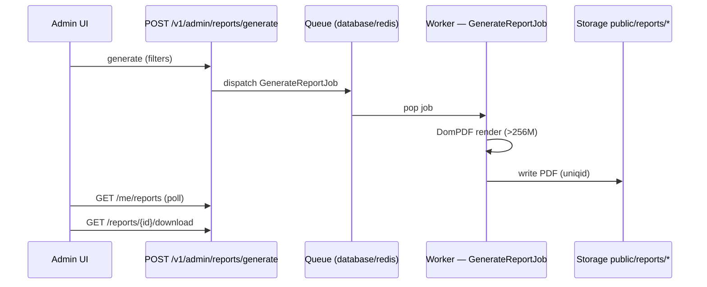

# Deployment — Queue, Cache & Backup

> **Operations guide** for queue workers, cache driver migration, and backup/DR.

> **References**
> - [app/Jobs/GenerateReportJob.php](file://app/Jobs/GenerateReportJob.php#L1-L40)
> - [config/queue.php](file://config/queue.php#L1-L40)
> - [config/cache.php](file://config/cache.php#L1-L30)
> - [database/seeders/SettingsSeeder.php](file://database/seeders/SettingsSeeder.php#L1-L30)
> - [Dockerfile — supervisor](file://../../Dockerfile#L56-L110)
> - [.env.example](file://../../.env.example#L1-L60)

## Table of Contents

1. [Queue Worker — Async Report Generation](#1-queue-worker-async-report-generation)
2. [Cache Driver: database → Redis](#2-cache-driver-database--redis)
3. [Backup Policy](#3-backup-policy)
4. [Env-Driven Site Settings](#4-env-driven-site-settings)

## 1. Queue Worker — Async Report Generation

Report generation is async: `POST /v1/admin/reports/generate` returns `202` with a `pending` report; the PDF is rendered by the queue worker. Poll progress via `GET /me/reports`, then download when `status = completed`.



```bash
# dev — single worker
php artisan queue:work --queue=default --tries=3 --timeout=300
# production: supervisor keeps it alive
```

Supervisor sample (`/etc/supervisor/conf.d/app-worker.conf`):

```ini
[program:app-worker]
process_name=%(program_name)s_%(process_num)02d
command=php /var/www/app/artisan queue:work --sleep=3 --tries=3 --timeout=300
directory=/var/www/app
autostart=true
autorestart=true
numprocs=2
redirect_stderr=true
stdout_logfile=/var/log/app-worker.log
```

* `--timeout=300` must stay ≥ job `$timeout` (DomPDF >256M). Deploy: `php artisan config:cache` **after** editing `.env`, then `php artisan queue:restart`.

**Section sources:** [app/Jobs/GenerateReportJob.php](file://app/Jobs/GenerateReportJob.php#L1-L30) · [Dockerfile supervisor](file://../../Dockerfile#L108-L110)

**Diagram sources:** Queue flow derived from `routes/api.php` report routes + `GenerateReportJob`.

## 2. Cache Driver: database → Redis

Current `CACHE_STORE=database` (shared table — correct for single instance; survives multi-instance). To switch for faster reads:

1. `composer require predis/predis` (or enable `php-redis`).
2. `.env`:
   ```env
   CACHE_STORE=redis
   REDIS_CLIENT=predis
   REDIS_HOST=127.0.0.1
   REDIS_PORT=6379
   REDIS_PASSWORD=
   ```
3. `php artisan cache:clear` (flush stale DB entries), then `php artisan config:cache`.

| Driver | Where keys live | TTL examples |
|---|---|---|
| `database` | `cache` table | `weather_*` 30 min, OSM 8–24 h, route 60 min, AI-attractions 24 h |
| `redis` | Redis (predis, no ext needed on PHP 8.5) | same TTLs, ~10× read latency win |

Failures are never cached. Move to Redis when `cache` table exceeds ~100k rows.

**Section sources:** [config/cache.php](file://config/cache.php#L15-L30) · [app/Services/OpenMeteoService.php](file://app/Services/OpenMeteoService.php#L10-L30) · [Dockerfile](file://../../Dockerfile#L85-L87) (predis note)

## 3. Backup Policy

| Scope | What | Frequency | Retention |
|---|---|---|---|
| Database | `mysqldump --single-transaction` | daily 03:00 | 14 days |
| `storage/app/public/reports/*` | generated PDFs (immutable `uniqid()` names) | daily, after queue drained | 14 days |
| `storage/app/public/uploads/*` | user media | daily | 30 days |
| `.env` + config | secrets & params | on every change (vault) | indefinite |

Cron (nightly):

```cron
0 3 * * * mysqldump --single-transaction -u $DB_USER -p$DB_PASS app > /backup/db_$(date +\%F).sql
0 4 * * * rsync -a /var/www/app/storage/app/public/reports/ /backup/reports_$(date +\%F)/
0 5 * * * find /backup -name "*.sql" -mtime +14 -delete -o -name "report*" -mtime +30 -delete
```

*Reports are immutable — offsite S3/SFTP copy suffices. DR restore order: DB → `storage/app/public` → `php artisan migrate` (playback pending migrations after dump time).*

**Section sources:** `storage/app/public` layout · `app/Jobs/GenerateReportJob.php` (uniqid naming)

## 4. Env-Driven Site Settings

`SettingsSeeder` reads from env instead of hardcoded values (Phase 9):

```env
SITE_FORK_PRICE_CENTS=50000      # trip fork price (EGP cents)
PLATFORM_COMMISSION_RATE=0.05    # platform booking commission rate
```

`php artisan db:seed --class=SettingsSeeder` re-syncs idempotently (`updateOrCreate`).

**Section sources:** [database/seeders/SettingsSeeder.php](file://database/seeders/SettingsSeeder.php#L1-L30) · [.env.example](file://../../.env.example#L80-L85)
