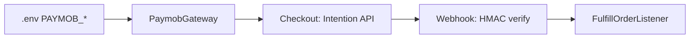

# Environment Variables Reference

> **Single source of truth** for `.env` keys consumed by the Itinera API. Values live in `.env` (never committed — only `.env.example` is versioned).

> **References**
> - [.env.example](file://../../.env.example#L1-L145)
> - [config/app.php](file://config/app.php#L1-L40)
> - [config/services.php](file://config/services.php#L1-L70)
> - [config/paymob.php](file://config/paymob.php#L1-L20)
> - [config/groq.php](file://config/groq.php#L1-L15)

## Table of Contents

1. [App](#app)
2. [Database](#db)
3. [Cache / Session / Queue](#cache--session--queue)
4. [Auth — JWT & OAuth](#auth--jwt--oauth)
5. [Payments — PayMob](#payments--paymob)
6. [External APIs](#external-apis)
7. [Site Settings — Env-Driven Seed](#site-settings--env-driven-seed)
8. [Sequencing & Safety Checklist](#sequencing--safety-checklist)

## App

| Key | Default | Purpose | Source |
|---|---|---|---|
| `APP_NAME` | TravelMate | Display name | [config/app.php](file://config/app.php#L15) |
| `APP_ENV` | `production` | Laravel env (phpunit.xml overrides to `testing`) | [phpunit.xml](file://../../phpunit.xml#L20) |
| `APP_KEY` | — | Cipher (`php artisan key:generate`) | [.env.example](file://../../.env.example#L5) |
| `APP_DEBUG` | `false` | Error verbosity — must be `false` in prod | [config/app.php](file://config/app.php#L30) |
| `APP_URL` | — | Base URL for signed links (email verify) | [.env.example](file://../../.env.example#L8) |
| `APP_LOCALE` | `en` | Default locale | [config/app.php](file://config/app.php#L80) |
| `APP_TIMEZONE` | `Africa/Cairo` | Service timezone | [.env.example](file://../../.env.example#L12) |
| `APP_MAINTENANCE_DRIVER` | `file` | Maintenance mode driver | [config/app.php](file://config/app.php#L110) |

**Section sources:** [config/app.php](file://config/app.php#L1-L120) · [.env.example](file://../../.env.example#L1-L15)

## DB

| Key | Default | Purpose |
|---|---|---|
| `DB_CONNECTION` | `mysql` | `sqlite` in tests (`phpunit.xml`) |
| `DB_HOST` / `DB_PORT` | `127.0.0.1` / `3306` | Host/port |
| `DB_DATABASE` / `DB_USERNAME` / `DB_PASSWORD` | — | Schema & creds |

**Section sources:** [config/database.php](file://config/database.php#L15-L30)

## Cache / Session / Queue

| Key | Default | Purpose |
|---|---|---|
| `CACHE_STORE` | `database` | Distributed cache — see [DEPLOYMENT.md](DEPLOYMENT.md#2-cache-driver-database--redis) for Redis switch |
| `CACHE_PREFIX` | — | Key namespace |
| `SESSION_DRIVER` | `database` | Session store |
| `SESSION_LIFETIME` | `120` | Minutes |
| `QUEUE_CONNECTION` | `database` | Worker driver (`sync` in tests) |
| `BROADCAST_CONNECTION` | `log` | Broadcast driver |

**Section sources:** [config/cache.php](file://config/cache.php#L10-L25) · [DEPLOYMENT.md](DEPLOYMENT.md#2-cache-driver-database--redis)

## Auth — JWT & OAuth

| Key | Default | Purpose |
|---|---|---|
| `JWT_SECRET` | — | `tymon/jwt-auth` HMAC (`php artisan jwt:secret`) |
| `GOOGLE_CLIENT_ID` / `GOOGLE_CLIENT_SECRET` | — | Socialite Google OAuth |
| `FACEBOOK_CLIENT_ID` / `FACEBOOK_CLIENT_SECRET` | — | Socialite Facebook OAuth |
| `GROQ_API_KEY` / `GROQ_MODEL` | `llama-3.1-8b-instant` | AI itinerary generation — see [config/services.php](file://config/services.php#L59-L62) |

**Section sources:** [config/jwt.php](file://config/jwt.php#L10-L20) · [config/services.php](file://config/services.php#L40-L65)

## Payments — PayMob

| Key | Default | Purpose |
|---|---|---|
| `PAYMOB_PUBLIC_KEY` | — | Checkout public key |
| `PAYMOB_SECRET_KEY` | — | API auth |
| `PAYMOB_HMAC` | — | Webhook HMAC verify — **production fail-fast if empty** (PaymobClient) |
| `PAYMOB_INTEGRATION_IDS` | — | Card/wallet integration IDs |



**Section sources:** [app/Services/Commerce/PaymobGateway.php](file://app/Services/Commerce/PaymobGateway.php#L1-L30) · [.env.example](file://../../.env.example#L139-L145)

**Diagram sources:** PayMob flow derived from `app/Services/Commerce/*` + `.env.example` Paymob block.

## External APIs

| Key | Default | Purpose |
|---|---|---|
| `OPENWEATHER_API_KEY` | — | Weather (Open-Meteo fallback) |
| `OSM_NOMINATIM_USER_AGENT` | TravelMate | Geocoding UA |
| `MAIL_MAILER` / `MAIL_HOST` / `MAIL_PORT` / `MAIL_USERNAME` / `MAIL_PASSWORD` / `MAIL_FROM_ADDRESS` | — | SMTP transport |

## Site Settings — Env-Driven Seed

| Key | Default | Purpose |
|---|---|---|
| `SITE_FORK_PRICE_CENTS` | `50000` | Trip fork price (EGP cents) — SettingsSeeder |
| `PLATFORM_COMMISSION_RATE` | `0.05` | Platform commission — SettingsSeeder |

> `SettingsSeeder` is idempotent (`updateOrCreate`).

## Sequencing & Safety Checklist

```bash
cp .env.example .env && php artisan key:generate && php artisan jwt:secret --force
# edit DB, PayMob, Groq keys
php artisan migrate --seed
php artisan config:cache   # on deploy, AFTER finalizing .env
php artisan queue:restart  # so workers pick up new config
```

* **Never commit `.env`.** Only `.env.example` is versioned.
* `APP_DEBUG=false` + `PAYMOB_HMAC` non-empty are production gates.

**Section sources:** [database/seeders/SettingsSeeder.php](file://database/seeders/SettingsSeeder.php#L1-L30)
