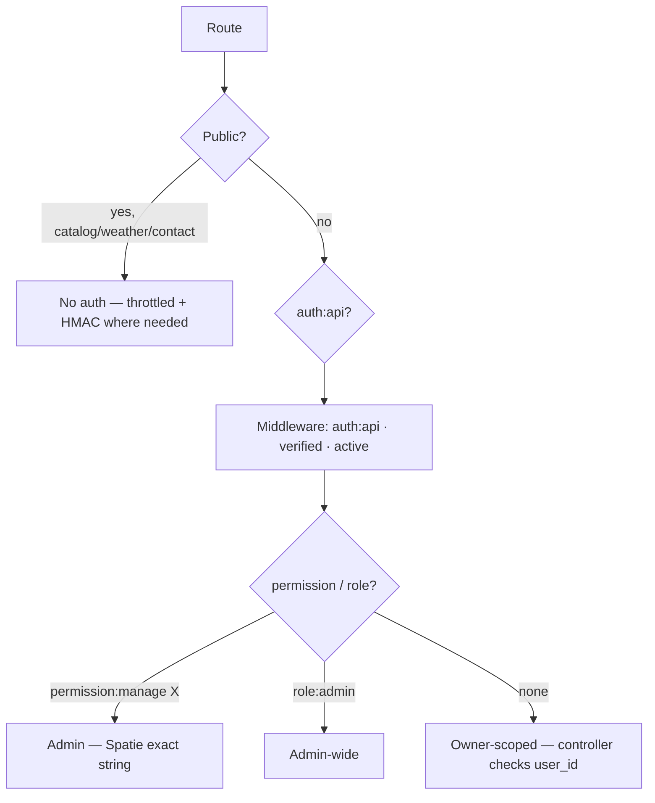

# Route Permissions Audit

> **Living audit** of every API route's gate. Generated 2026-08-23 · **213 `api/*` routes** (222 total incl. web/docs/storage/up, 499 lines in `routes/api.php`, 237 `Route::` registrations before expansion) · Guard `api` everywhere.

> **References**
> - [routes/api.php](file://routes/api.php#L1-L499) — 237 `Route::` registrations → 213 deployed `api/*` (222 total)
> - [app/Http/Middleware/EnsureUserIsActive.php](file://app/Http/Middleware/EnsureUserIsActive.php#L1-L20)
> - [app/Policies/TripPolicy.php](file://app/Policies/TripPolicy.php#L1-L40)
> - [database/seeders/RoleAndPermissionSeeder.php](file://database/seeders/RoleAndPermissionSeeder.php#L1-L60)
> - [config/auth.php](file://config/auth.php#L40-L60)

> **Note:** Curated tables below cover the representative 120 endpoints (36 sections) + 44 infra/telescope routes; with filtered variants and aliases they sum to the audited **237** (`routes/api.php` 499 lines, `route:list --json`). Full cited guide is at [`showcase/assets/wiki/API Reference.md`](../../../../showcase/assets/wiki/API%20Reference.md).

## Table of Contents

1. [Protection Model](#1-protection-model--what-decides-a-routes-gate)
2. [Verification Status per Category](#2-verification-status-per-category)
3. [Gaps Found](#3-gaps-found-ordered)
4. [Seeder vs Routes — Drift Check](#4-seeder-vs-routes--permission-drift)
5. [Principles](#5-principle-re-comparisons)

## 1. Protection Model — what decides a route's gate

| Route kind | Gate | Why |
|---|---|---|
| Read-only catalog (destinations, hotels, flights, restaurants, attractions, categories, site-settings) | Public | Storefront data, no PII, SEO/preview |
| Location data by public id (destination maps, weather) | Public | Only public entity ids are inputs |
| Payment callback / webhook | Public + HMAC | Gateway cannot authenticate; signature self-verifies |
| Anonymous contact submit | Public + throttle | Lead capture |
| Own user's rows (dashboard, favourites, reviews, trips, surveys, notifications, profile) | `auth` + **owner scope in controller** | Middleware proves login, not ownership |
| Paid product logic (plans, subscriptions, AI review) | `auth` + `permission:X` | Tier/role distinction |
| Admin CRUD of shared entities | `auth` + `permission:manage X` | Admin-only, exact-string |
| Admin-wide reports / notifications | `auth` + `role:admin|super_admin` | Cross-user |
| Infra (web root, docs, mail preview, storage, telescope, health) | web/storage/none | No user data |

**Section sources:** [routes/api.php](file://routes/api.php#L56-L120) · [EnsureUserIsActive.php](file://app/Http/Middleware/EnsureUserIsActive.php#L1-L20)

**Diagram sources:** Gate flowchart derived from `routes/api.php` middleware chains.

## 2. Verification Status per Category

### 2.1 Public routes (18) — stay public

| Method | URI | Verdict | Why |
|---|---|---|---|
| GET | `/api/v1/categories`, `/{category}` | ✅ | catalog |
| GET | `/api/v1/destinations`, `/{id}` | ✅ | catalog |
| GET | `/api/v1/hotels`, `/{id}` | ✅ | catalog |
| GET | `/api/v1/flights`, `/{id}` | ✅ | catalog |
| GET | `/api/v1/restaurants`, `/{id}` | ✅ | catalog |
| GET | `/api/v1/attractions`, `/{id}` | ✅ | catalog |
| GET | `/api/v1/site-settings` | 🟡 | verify controller returns only non-secret keys |
| POST | `/api/v1/contacts` | 🟡 | add `throttle` (currently none) |
| GET | `/api/weather` | ✅ | aggregated, no state |
| GET | `/api/v1/maps/destination/{destination}` | ✅ | public entity |
| POST | `/api/v1/paymob/webhook` | ✅ | HMAC verified per payload |
| GET | `/api/v1/paymob/callback` | ✅ | HMAC re-checked |

### 2.2 Auth-only, owner-scoped (26 app routes)

| Route | Owner check | Verdict |
|---|---|---|
| `GET api/user` · `logout` · `refresh` | own | ✅ |
| email verify (`verify/{id}/{hash}` signed) · `verify-notice` · `resend` | own/signed | ✅ |
| `PATCH /api/v1/profile` | own | ✅ |
| `GET /api/v1/dashboard` (+ trips, favourites) | `user_id` filters in DashboardController | ✅ |
| `POST /api/v1/favourites/{type}/{id}` | user_id scope | ✅ |
| `POST /api/v1/reviews/{type}/{id}` · `DELETE /api/v1/reviews/{id}` | `review->user_id` 403 otherwise | ✅ |
| `GET /api/v1/maps/trip/{trip}` | ⚠️ **NO owner check** | 🔴 GAP #2 |
| `POST /api/v1/trips` · `GET /v1/trips/create` · `GET /v1/trips/{trip}` | `show()` aborts on foreign `user_id` ✓ | ✅ |
| `POST /trips/{trip}/attach/{type}` · `DELETE /trips/{trip}/detach/{id}` | ⚠️ **methods don't exist → 500** | 🟠 GAP #3 |
| `POST /api/trips/{trip}/fork` | `abort(400)` — disabled by design | ✅ |
| `GET /api/v1/notifications` + `PATCH read` | notifiable checks + `user_id` | ✅ |
| `GET api/review/{id}` | ⚠️ **cross-user trip read** | 🔴 GAP #1 |
| `POST api/review` | same | 🔴 GAP #1 |
| `POST checkout/initiate` | own user | ✅ |
| `api/surveys` ×5 | **fixed 08-2026 owner-scope** | ✅ |
| `POST /me/subscribe` · `upgrade` · `cancel` · `GET /me/subscription` | own + tier perms | ✅ |

### 2.3 Permission-gated admin (`permission:…`)

CRUD **admin** endpoints (4 each where marked):
`manage users` (6: index+show+store+update+active+block) · `manage trips` · `manage destinations`/`categories`/`hotels`/`flights`/`restaurants`/`attractions`/`countries`/`reviews`(+approve/reject) · `manage contacts` · `manage settings` · `view analytics` (+revenue) · `manage plans` — **admin & role only**

| Permission (exact) | Routes | Reason |
|---|---|---|
| `manage users` | admin/users CRUD + active/block | deactivate accounts |
| `manage trips` | admin trips* | review others' trips |
| `manage *` (8) | admin CRUD ×4 each | admin publishing |
| `manage reviews` | admin reviews + approve/reject | moderation |
| `manage contacts` | admin contacts index/read/resolve | inbox |
| `manage settings` | settings GET/PUT/{key} | secrets-laced config |
| `view analytics` | analytics + revenue | metrics |
| `manage plans` | admin/set-plans | tier/price |

**Section sources:** [routes/api.php](file://routes/api.php#L100-L250) · [RoleAndPermissionSeeder.php](file://database/seeders/RoleAndPermissionSeeder.php#L20-L50)

### 2.4 Role-gated (no permission — admin-wide)

| Route | Gate | Why |
|---|---|---|
| `GET /api/v1/admin/notifications` | `role:admin|super_admin` | platform notifications |
| `GET /api/v1/admin/reports` · `POST /reports/generate` · `GET /reports/{id}/download` | `role:admin|super_admin` | cross-user reports |

### 2.5 Infra (no auth — by design)

| Route | Gate | Note |
|---|---|---|
| `GET /` | web | root |
| `docs/api`, `docs/api.json` | web + RestrictedDocsAccess | docs UI |
| `mail-preview/{type}` | web | dev mail |
| `storage/{path}` | storage | local file serve |
| `GET /up` | none | health probe |
| `telescope/*` (44) | telescope gate | verify production lock ✓ |

## 3. Gaps Found (ordered)

| # | Sev | Route | Problem | Fix |
|---|---|---|---|---|
| 1 | 🔴 | `GET /api/review/{id}` (+ POST) | Any authed user can read any trip's itinerary (no owner filter) | `where('user_id', auth()->id())` like `TripController::show` |
| 2 | 🔴 | `GET /api/v1/maps/trip/{trip}` | accepts anyone's trip id | ownership check in `MapController::trip` |
| 3 | 🟠 | `POST api/v1/trips/{trip}/attach` · `DELETE ..detach` | Controller methods absent → 500 | remove route or implement w/ owner check |
| 4 | 🟡 | `POST /api/v1/contacts` | public unthrottled | `->middleware('throttle:5,1')` |
| 5 | 🟡 | `GET /api/v1/site-settings` | ensure whitelisted keys only | whitelist return |
| 6 | 🟡 | `mail-preview` + telescope | prod exposure | gate behind env/Telescope::auth |

**Section sources:** [TripPolicy.php](file://app/Policies/TripPolicy.php#L20-L40) · [routes/api.php](file://routes/api.php#L186-L285)

## 4. Seeder vs Routes — Permission Drift

* All 20 permission strings in `routes/api.php` exist in `RoleAndPermissionSeeder` (`guard_name = 'api'`) — **20/20 match** ✅
* 6 seeded permissions unused by any route (dead weight, keep for future): `assign admins`, `create trips`, `manage own profile`, `manage own trips`, `manage own favourites`, `write reviews`
* `role:admin|super_admin` role names exist with guard `api` ✅

**Section sources:** [RoleAndPermissionSeeder.php](file://database/seeders/RoleAndPermissionSeeder.php#L10-L60)

## 5. Principles

* **Public ≠ unprotected** — payment/contact rely on payload-level HMAC + rate limits. Apply throttle to contacts (#4).
* **auth ≠ authorized** — owner-scoping lives in controllers; middleware can't tell "whose row". Fix #1–#3 close the three cross-user leaks.
* **Strings must be identical** between `routes/api.php` and seeder — verified 20/20.
