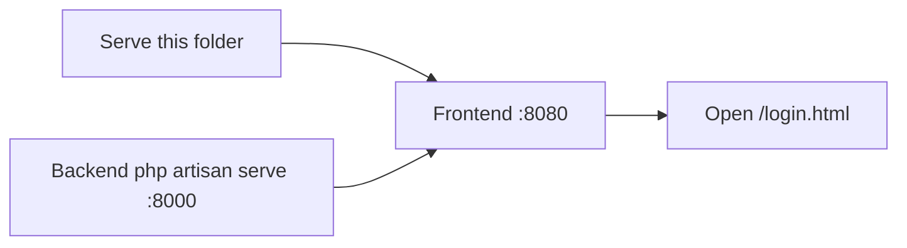
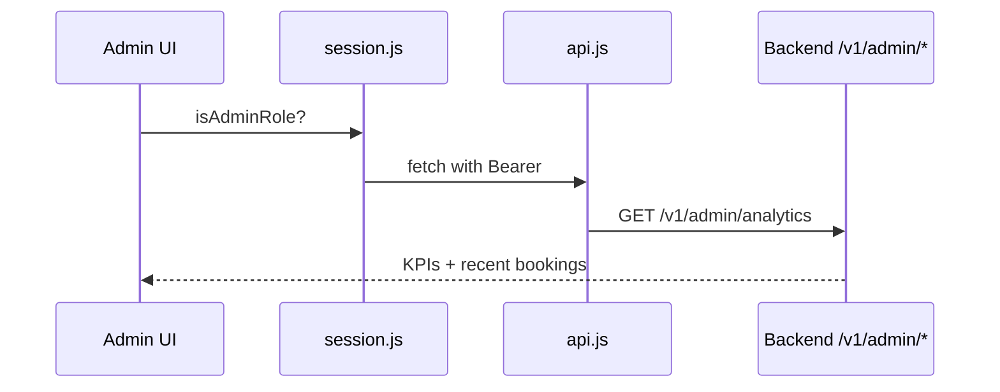

# Itinera — Frontend

> **Vanilla JS luxury frontend** — boarding-pass themed travel platform. Static multi-page app + Laravel API (`Team2-Conference-Project`). No build step for pages (serve via `file://`-tolerant static host; admin suite is vanilla JS too).

> **References**
> - [index.html](file://index.html) — public landing
> - [admin/index.html](file://admin/index.html) — admin shell (10 modules)
> - [assets/js/common.js](file://assets/js/common.js#L1-L30) — shared core (apiBase, session, toasts)
> - [assets/css/tokens.css](file://assets/css/tokens.css) — design tokens (obsidian/gold/emerald)
> - [assets/js/config.js](file://assets/js/config.js) — TP_CONFIG

## Table of Contents

1. [Run](#run)
2. [Routes](#routes)
3. [Admin Suite](#admin-suite)
4. [Auth & RBAC](#auth--rbac)
5. [API Surface Used](#api-surface-used)
6. [Design System](#design-system)
7. [Notes](#notes)

## Run

1. Serve this folder (PHP built-in or `python -m http.server 8080` from `fullstack/Frontend/`).
   * `python -m http.server 8080` in `fullstack/Frontend/`
2. API at `127.0.0.1:8000` (see `Team2-Conference-Project` backend `php artisan serve`).
3. Open `http://localhost:8080/index.html` (or `login.html`).

> `file://` is tolerated for static assets, but auth pages redirect to `/login.html` via absolute path — serve via HTTP for full flow.

**Section sources:** [index.html](file://index.html#L1-L20) · [assets/js/common.js](file://assets/js/common.js#L10-L16) (`apiBase` resolution)

**Diagram sources:** Run flow derived from `README.md` quick start + `common.js` API base logic.

## Routes

| Page | File | Notes |
|---|---|---|
| Landing | `index.html` | Hero + KPI + catalog preview |
| Login | `auth/login.html` | JWT flow |
| Register | `auth/register.html` | email verify trigger |
| Forgot / Reset | `auth/forgot.html` / `auth/reset.html` | token mail flow |
| Verify | `auth/verify.html` | signed link handler |
| Dashboard (user) | `overview.html` / `dashboard.html` | personal stats |
| Admin shell | `admin/index.html` | 10 modules (see below) |

## Admin Suite

Boarding-pass motif: `.ticket` cards, KPI tickets with `.ticket-edge` notches, `.sil` side-indicator, `.label-eyebrow` micro-labels, GSAP 3.12.5 entrance stagger (RM-guarded).

### Pages

| Page | File | JS | Purpose |
|---|---|---|---|
| Dashboard (KPIs, recent bookings) | `admin/index.html` | `admin-dashboard.js` | revenue + users KPIs |
| Users | `admin/users.html` | `admin-users.js` | CRUD + active/block |
| Trips | `admin/trips.html` | `admin-trips.js` | admin trip moderation |
| Reviews | `admin/reviews.html` | `admin-reviews.js` | approve/reject |
| Analytics | `admin/analytics.html` | `admin-analytics.js` | revenue + bookings |
| Settings | `admin/settings.html` | `admin-settings.js` | site settings CRUD |
| Attractions (showcase) | `admin/attractions.html` | — | static showcase |
| CRUD: Countries / Destinations / Hotels / Restaurants | `admin/countries.html` etc. | `admin-crud.js` (shared) | generic datatable |

Shared: `admin-shell.js` (sidebar/nav), `admin-chrome.js` (topbar, theme toggle, collapse, global search bus, modal ESC + scroll-lock), `admin-kit.js` (table/empty/badge kit), `config.js` / `session.js` / `api.js`. Scripts are cache-versioned (`?v=` suffix) — bump on ship.

### Refinement Passes (vanilla ports of shadcn patterns)

* **Dark theme**: `.dark` token block in `tokens.css`; toggle `#theme-toggle` persisted `itinera_theme`, no flash, `aria-pressed` synced.
* **Topbar**: sticky glass strip on all 10 admin pages with global search (`admin:search` custom event), theme toggle, collapsed brand.
* **Sidebar**: active-link pill + left indicator; collapse 264px → 82px icon rail (`itinera_sidebar`), labels hidden, persisted.
* **Datatable** (`admin-crud.js`): search + sortable headers (`aria-sort`) + pagination footer. Contract `?page&per_page&search&sort_by&sort_order`; normalizes `{data:{data,links,meta}}` vs bare array. Search also filters users/trips/reviews custom tables.
* **Empty states**: icon + title + hint (+ optional action) on zero rows / no-match.
* **Dialogs**: ESC closes (focus + scroll-lock release), backdrop blur, internal scroll, close button.
* **Toasts**: `It.feedback.toast()` bottom-right stack, ~4s auto-dismiss with progress drain, max 4 concurrent.
* **Form states**: required-field validation on submit with `is-error`; toast on invalid.
* **Stat widgets**: KPI delta chips (neutral labels; no prev-period baseline yet).
* **Chart headers**: icon chip + title in analytics cards.

**Section sources:** [admin/index.html](file://admin/index.html#L1-L40) · [assets/js/admin-crud.js](file://assets/js/admin-crud.js#L1-L40) · [assets/css/tokens.css](file://assets/css/tokens.css#L1-L40)

## Auth & RBAC

* Token in `localStorage` under `itinera_token` (admin gate re-uses user token).
* Admin check: `session.isAdminRole(session.roleOf(user))`; non-admin or missing token → `session.redirectToLogin()`.
* Test creds: `admin@threedos.com` / `password` (seed).

**Section sources:** [assets/js/session.js](file://assets/js/session.js#L10-L30) · [assets/js/config.js](file://assets/js/config.js#L1-L20)

## API Surface Used

* `GET /v1/admin/analytics` — users + revenue KPIs
* `GET /v1/admin/analytics/revenue` — bookings KPI + recent bookings
* CRUD endpoints via `admin-crud.js` per entity
* All admin calls use `{ auth: true }` (adds `Authorization: Bearer` via `api.js`)

**Section sources:** [assets/js/api.js](file://assets/js/api.js#L10-L40)

**Diagram sources:** Admin flow derived from `admin-dashboard.js` + `api.js`.

## Design System

* **Tokens:** `tokens.css` (obsidian `#05070d`, gold `#fbbf24`, emerald `#34d399`, mono `JetBrains Mono`, serif `Newsreader`).
* **GSAP 3.12.5 CDN** — entrance animations run once after data load; `prefers-reduced-motion: reduce` skips them.
* **Density:** desktop `max-width 1320px`, sidebar `264px`; `body[data-page="admin"]` must stay `display: block` (auth.css grids body for login card — see admin.css override).

### Polish & A11y (Phase 18)

* **Mobile Drawer**: Fixed off-canvas sidebar (<1024px) with backdrop, escape/click-out dismiss.
* **Motion**: Bezier curves (`--dur-base`, `--ease-out`) globally, no stock defaults.
* **Theming**: Tri-state `light/dark/system` in `itinera_theme`; centralized status colors (`ok/warn/danger`) in `tokens.css`.
* **Data Vis**: Vanilla bar charts with shimmer skeletons, `aria-live` tooltips, calculated grid ticks.
* **A11y**: Skip links, `aria-label` on icon buttons, SVG `aria-hidden`, keyboard focus verified.

**Section sources:** [assets/css/tokens.css](file://assets/css/tokens.css#L1-L50) · [assets/css/admin.css](file://assets/css/admin.css#L1-L40)

## Notes

* Asset scripts are cache-versioned (`?v=` suffix) — bump when shipping JS/CSS changes.
* Admin pages share the same auth gate as the public app — no separate admin token.

---

MIT — frontend of Itinera, Team 2.
